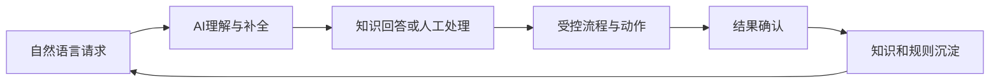
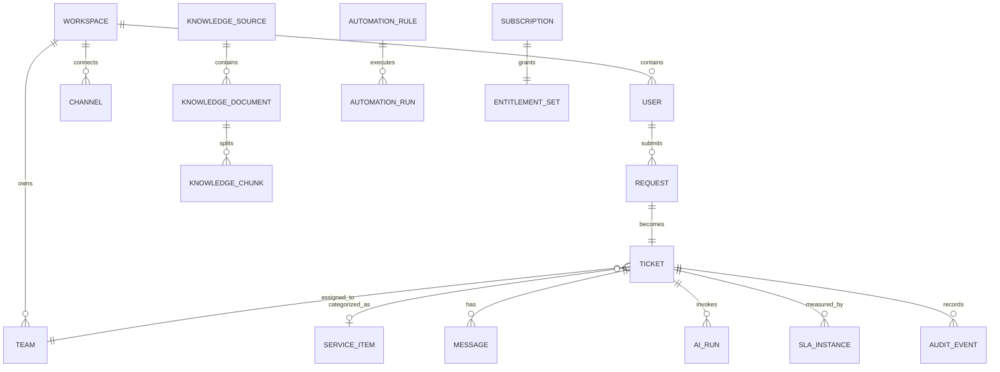
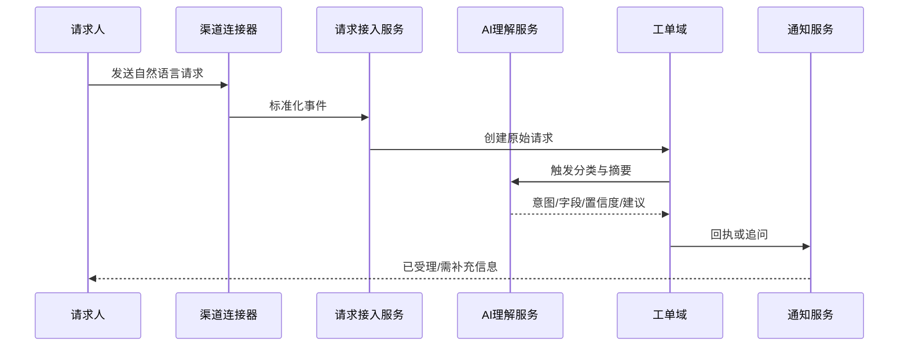
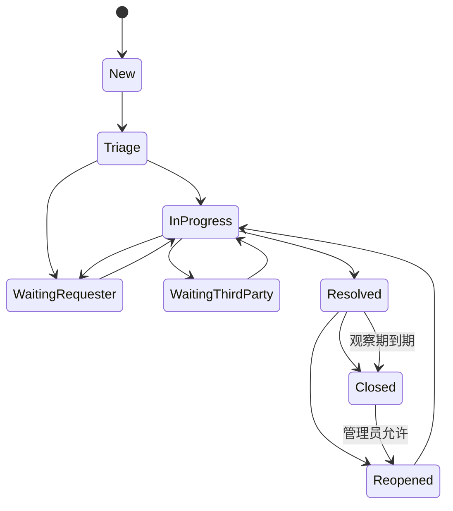
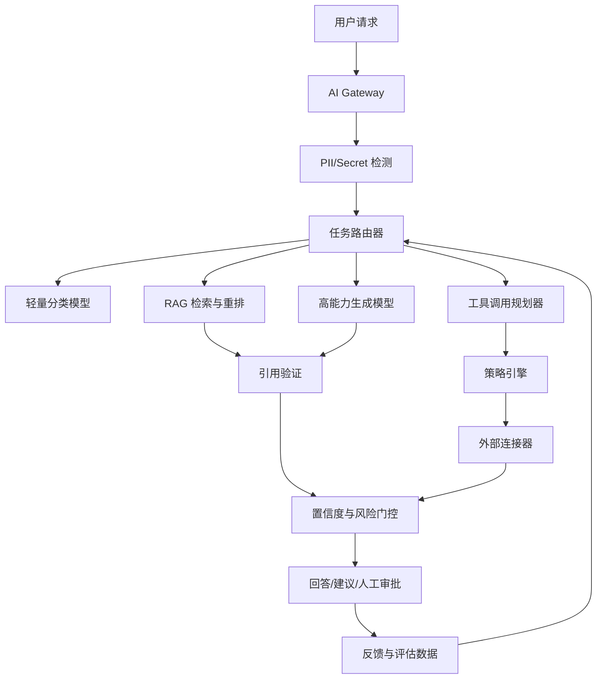
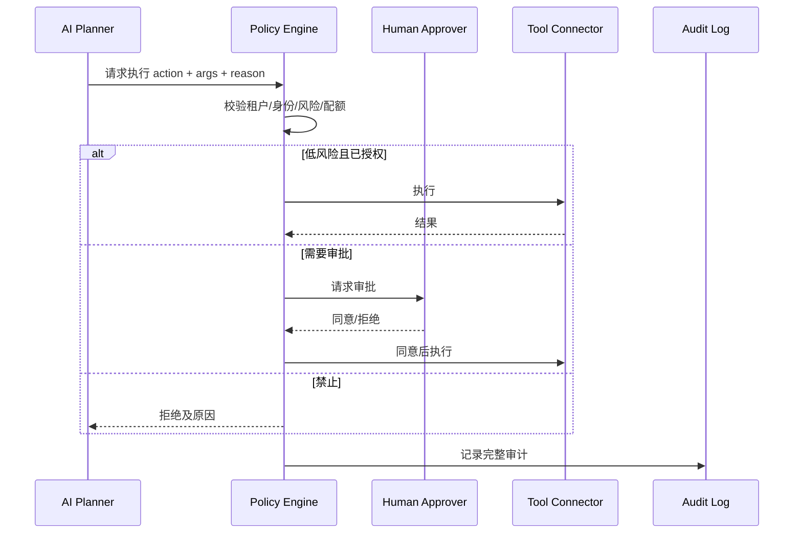

# AI 原生 ITSM SaaS 产品需求说明书（PRD）

> **工作产品名：灵犀服务台 / Lingxi Service Desk（暂定）**  
> **版本：V1.0**  
> **日期：2026-07-14**  
> **目标市场：中国大陆成长型企业**  
> **商业模式：PLG、自助注册、分层订阅**  
> **交付边界：个人工作室可实现的首阶段产品，PMF 后扩展团队**

---

# 0. 文档控制

## 0.1 目标

本 PRD 定义首阶段 AI ITSM SaaS 的产品范围、用户流程、功能需求、AI 安全机制、技术边界、数据模型、指标体系、验收标准和研发计划。

## 0.2 产品成功标准

产品不是以“完成多少模块”为成功，而以以下结果为成功：

1. 新工作区无需实施人员，在 10 分钟内连接一个真实入口。
2. 24 小时内完成首个 AI 辅助有效解决。
3. 服务团队持续把真实请求放入系统，而不是回到群聊和 Excel。
4. AI 输出有引用、可反馈、可人工接管。
5. 免费工作区能够自然触发邀请和升级。
6. 单租户支持成本与收入可形成健康毛利。

## 0.3 术语

| 术语 | 定义 |
|---|---|
| 工作区 Workspace | 一个客户组织的逻辑租户 |
| 请求人 Requester | 提交服务请求的员工或外部协作者 |
| 坐席 Agent | 处理请求、维护知识和规则的服务人员 |
| 管理员 Admin | 管理工作区、计费、安全和配置的用户 |
| 请求 Request | 用户通过 IM、邮件或 Web 提出的原始内容 |
| 工单 Ticket | 请求经过结构化后的可追踪服务记录 |
| 服务项 Service Item | 可被申请或报告的标准服务 |
| 知识 Knowledge | 经审批可用于人工和 AI 回答的内容 |
| AI 动作 AI Action | 一次可计量的 AI 分类、生成、检索或执行活动 |
| 有效解决 Verified Resolution | 用户确认解决，或观察期内未重开且满足关闭条件 |
| 自动化 Automation | 由事件、条件和动作组成的确定性规则 |
| Agent 执行 | AI 在策略约束下调用外部工具完成动作 |

---

# 1. 产品愿景与定位

## 1.1 愿景

让任何成长型企业都能在不采购重型平台、不聘请实施顾问的情况下，建立可追踪、可复用、可自动化的内部服务体系。

## 1.2 产品定位

这是一个 **AI 原生内部服务管理 SaaS**，首阶段聚焦 IT 支持，后续可扩展到 HR、行政和其他共享服务。

产品的核心不是工单表单，而是以下闭环：



## 1.3 产品价值主张

### 对请求人

- 在现有聊天工具或邮箱中直接求助。
- 不需要理解事件、服务请求、优先级等 ITSM 术语。
- 即时获得答案或明确处理进度。

### 对工程师

- 自动摘要、分类、补齐、分派和生成回复。
- 快速找到相似问题和可引用知识。
- 减少重复操作和文档维护。

### 对管理者

- 统一掌握请求量、积压、SLA、解决效率和满意度。
- 识别高频问题和自动化机会。
- 以数据证明团队价值。

---

# 2. 目标用户与 JTBD

## 2.1 Persona A：IT 负责人

**背景**：管理 2—15 人 IT 团队，服务 50—500 名员工。  
**现状**：请求来自群聊、私聊、邮箱和 OA；没有统一统计。  
**JTBD**：当团队请求快速增长时，希望在不开展大型项目的情况下建立统一服务入口和基本管理机制。  
**成功结果**：一周内上线；请求不遗漏；能查看团队工作量和 SLA；不增加专职管理员。

## 2.2 Persona B：一线 IT 工程师

**背景**：处理账号、网络、终端、软件、权限等问题。  
**现状**：重复回答、信息缺失、频繁切换工具。  
**JTBD**：收到问题时，希望系统自动提供上下文和建议，让自己更快完成处理。  
**成功结果**：少问一次、少查一次、少复制一次、少写一篇文档。

## 2.3 Persona C：普通员工

**背景**：不理解 IT 流程，只想尽快解决问题。  
**JTBD**：遇到问题时，希望在熟悉的入口用自然语言描述，立即知道下一步。  
**成功结果**：不用找联系人、不用填复杂表单、可以随时查询进度。

## 2.4 Persona D：安全/合规管理员

**JTBD**：采购 SaaS 和 AI 产品时，希望确认数据存储、权限、日志、模型供应商和删除机制。  
**成功结果**：可获取安全资料、审计记录、数据清单和处理者信息。

---

# 3. 产品范围

## 3.1 P0：MVP 范围

1. 工作区、自助注册、邀请和基础权限。
2. Web 门户和邮件接入。
3. 飞书机器人/应用接入。
4. 统一请求收件箱和工单生命周期。
5. AI 分类、摘要、字段补齐、优先级与分派建议。
6. 文档导入、知识管理和引用式问答。
7. 工程师回复草稿和相似工单推荐。
8. 解决后知识草稿。
9. 基础服务项、SLA 和自动化规则。
10. 基础报表、满意度、审计日志。
11. 套餐、配额、订阅和用量管理。
12. 数据导出、删除和保留策略。
13. 产品埋点、AI 质量评估和告警。

## 3.2 P1：公开 Beta 后

- 企业微信或钉钉第二连接器。
- OIDC/SAML SSO。
- 多团队与值班规则。
- API、Webhook 和通用连接器。
- 轻量资产上下文。
- 审批节点和受控动作。
- 自然语言规则生成。
- 高级报表和自动价值报告。

## 3.3 P2：PMF 后

- 多部门 ESM。
- 事件聚类和重大事件管理。
- 问题管理和根因知识。
- 变更管理 Lite。
- 连接器市场和模板市场。
- 专属数据库/单租户版本。
- BYOM 与私有模型网关。

## 3.4 非目标

- 完整 CMDB 和自动发现。
- 监控、日志和 APM。
- 远程控制、补丁和终端管理。
- 通用 BPM/低代码平台。
- 复杂项目管理。
- 自研基础模型。
- 大规模呼叫中心和电话系统。

---

# 4. 信息架构

## 4.1 坐席端导航

1. **收件箱**
   - 我的队列
   - 未分派
   - 等待用户
   - SLA 风险
   - 已解决
2. **知识**
   - 已发布
   - 草稿
   - 待审核
   - 数据源
3. **服务**
   - 服务项
   - SLA
   - 自动化
4. **分析**
   - 服务概览
   - AI 效果
   - 团队效率
   - 高频问题
5. **设置**
   - 成员与角色
   - 入口与集成
   - AI 与模型
   - 安全与数据
   - 套餐与用量

## 4.2 请求人端

- 发起请求。
- 与 AI 或工程师对话。
- 查看进度。
- 浏览知识。
- 确认解决和评价。

请求人优先在 IM 内完成，不强制进入 Web 门户。

---

# 5. 领域模型

## 5.1 核心实体



## 5.2 Ticket 主字段

| 字段 | 类型 | 说明 |
|---|---|---|
| id | UUID | 全局唯一 ID |
| workspace_id | UUID | 租户隔离字段 |
| number | String | 工作区内可读编号 |
| title | String | AI 可生成，人工可修改 |
| description | Rich Text | 原始请求和结构化描述 |
| requester_id | UUID | 请求人 |
| status | Enum | 状态机字段 |
| priority | Enum | P1—P4 |
| impact | Enum | 影响范围 |
| urgency | Enum | 紧急程度 |
| team_id | UUID | 处理团队 |
| assignee_id | UUID nullable | 处理人 |
| service_item_id | UUID nullable | 服务项 |
| source_channel | Enum | web/email/feishu/... |
| ai_confidence | Decimal | 当前主要分类置信度 |
| due_at | Timestamp | SLA 目标 |
| resolved_at | Timestamp nullable | 解决时间 |
| closed_at | Timestamp nullable | 关闭时间 |
| reopen_count | Integer | 重开次数 |
| created_at/updated_at | Timestamp | 时间戳 |

## 5.3 租户隔离要求

- 所有业务表必须包含 workspace_id。
- 所有查询默认注入租户条件。
- 关键表启用 PostgreSQL RLS 或等效机制。
- 对象存储路径按租户隔离并使用短期签名 URL。
- 向量检索必须使用 workspace_id 过滤。
- 缓存 Key 必须包含 workspace_id。
- 日志不得记录完整敏感正文。
- 自动化和 AI 工具上下文不得跨租户复用。

---

# 6. 核心业务流程

## 6.1 工作区自助注册

### 主流程

1. 用户通过邮箱或第三方身份注册。
2. 创建工作区名称和数据区域。
3. 选择团队规模、员工规模和当前处理方式。
4. 系统推荐首个入口：Web、邮箱或飞书。
5. 用户完成连接测试。
6. 系统创建示例请求，但明确区分示例与真实数据。
7. 引导导入一个知识源。
8. 等待首个真实请求并展示实时检查表。

### 验收标准

- 无需人工即可完成。
- 注册至工作区创建 P95 < 5 秒。
- 首屏只要求完成一个关键动作。
- 离开后可从原步骤继续。
- 所有步骤产生埋点。

## 6.2 请求进入与结构化



### 去重规则

系统对以下条件计算相似度：

- 同一请求人短时间内的相同文本。
- 同一渠道重复事件 ID。
- 相似标题、相同设备/应用和相近时间。
- 已知群发故障事件。

默认只提示合并，不自动合并，除非规则明确授权。

## 6.3 工单状态机



### 状态定义

| 状态 | 说明 | SLA 行为 |
|---|---|---|
| New | 已创建未处理 | 响应 SLA 运行 |
| Triage | 系统/人工分诊 | 响应 SLA 运行 |
| In Progress | 正在处理 | 解决 SLA 运行 |
| Waiting Requester | 等待用户补充 | 可暂停解决 SLA |
| Waiting Third Party | 等待供应商 | 按策略暂停或继续 |
| Resolved | 已给出解决方案 | 进入确认观察期 |
| Closed | 已确认关闭 | SLA 完成 |
| Reopened | 用户反馈未解决 | 恢复 SLA 或新建周期 |

## 6.4 AI 自助回答

1. AI 识别意图。
2. 基于请求人权限检索已发布知识。
3. 生成包含引用的回答。
4. 计算置信度和风险级别。
5. 高置信、低风险场景可直接回复。
6. 用户选择“已解决”或“仍需帮助”。
7. 未解决时自动创建/升级工单，并保留完整上下文。

### 默认门控建议

- 置信度 ≥0.92 且知识引用有效：可自动回答。
- 0.75—0.92：回答后要求用户确认，并同时进入待观察队列。
- <0.75：不声称已解决，转人工并给出建议草稿。

阈值必须可配置，并按意图、数据源和风险级别细分。

## 6.5 知识闭环

1. 工单解决时生成知识草稿。
2. 草稿包含问题、适用范围、步骤、验证和回退。
3. 系统检查是否与现有知识重复。
4. 知识负责人审核、修改和发布。
5. 发布后进入向量索引。
6. AI 回答记录使用了哪些知识。
7. 低评价答案触发知识质量任务。

---

# 7. 功能需求详述

## 7.1 工作区与成员

### FR-W-001 创建工作区

**优先级：P0**

- 支持邮箱注册。
- 支持工作区名称、简称、默认时区和语言。
- 中国区默认时区 Asia/Shanghai。
- 创建者默认 Owner。
- 每个用户可加入多个工作区。

**验收**：创建成功后 5 秒内进入 onboarding；工作区数据与其他租户不可见。

### FR-W-002 邀请成员

- 邮件邀请链接 72 小时有效。
- 支持批量 CSV 导入。
- 支持请求人、坐席、管理员三类基础角色。
- 邀请行为计入增长漏斗。

### FR-W-003 角色权限

基础 RBAC：

| 权限 | Requester | Agent | Admin | Owner |
|---|---:|---:|---:|---:|
| 提交和查看本人请求 | ✓ | ✓ | ✓ | ✓ |
| 查看团队队列 | — | ✓ | ✓ | ✓ |
| 处理工单 | — | ✓ | ✓ | ✓ |
| 发布知识 | — | 可配置 | ✓ | ✓ |
| 管理入口和规则 | — | — | ✓ | ✓ |
| 管理计费 | — | — | 可配置 | ✓ |
| 删除工作区 | — | — | — | ✓ |

P1 扩展到团队范围、字段级和 ABAC。

## 7.2 渠道与接入

### FR-C-001 Web 门户

- 提供工作区子域名。
- 支持自然语言输入、附件和截图。
- AI 实时建议知识答案。
- 不强制用户选择复杂分类。
- 提交后显示编号、负责人和预计响应时间。

### FR-C-002 邮件接入

- 为每个工作区提供专属收件地址。
- 支持转发已有共享邮箱。
- 解析发件人、主题、正文、附件和线程。
- 回复邮件自动追加到同一工单。
- 使用 Message-ID/In-Reply-To/References 保持线程。
- 防止自动回复循环和邮件炸弹。

### FR-C-003 飞书接入

飞书开放平台支持事件订阅，应用可以通过 HTTP 或长连接方式接收消息和资源变化事件。[R1]

P0 范围：

- 工作区管理员安装应用。
- OAuth/租户授权。
- 机器人私聊提问。
- 指定群中 @机器人提问。
- 卡片展示状态、负责人和操作按钮。
- 工程师回复同步到会话。
- 用户可点击“已解决/仍需帮助”。

安全要求：

- 校验事件签名和重放。
- Token 加密存储。
- 权限按最小范围申请。
- 连接器故障进入重试和死信队列。

### FR-C-004 企业微信与钉钉

P1 实现。钉钉开放平台支持机器人和事件订阅，并推荐 Stream 模式接收事件。[R2]

抽象统一的 Channel Adapter：

```typescript
interface ChannelAdapter {
  verifyEvent(request: IncomingRequest): Promise<VerifiedEvent>;
  normalize(event: VerifiedEvent): Promise<InboundMessage>;
  sendMessage(target: ChannelTarget, message: OutboundMessage): Promise<SendResult>;
  updateCard?(messageId: string, card: StatusCard): Promise<void>;
  revokeAccess?(): Promise<void>;
}
```

## 7.3 统一收件箱

### FR-I-001 队列视图

- 默认视图：我的、未分派、SLA 风险、等待用户、已解决。
- 支持筛选团队、状态、优先级、服务项、来源、标签和时间。
- 支持保存个人视图。
- 列表展示 AI 摘要、请求人、来源、等待时间和 SLA 倒计时。

### FR-I-002 快速操作

- 分派给自己。
- 修改状态和优先级。
- 插入知识答案。
- 生成回复草稿。
- 添加内部备注。
- 合并/关联相似工单。

### FR-I-003 工单详情

布局：

- 左侧：对话与处理记录。
- 右侧：请求人、服务项、优先级、SLA、关联知识和 AI 建议。
- 顶部：状态、负责人、关键动作。
- AI 建议必须显示原因和引用，不得只给结论。

## 7.4 工单管理

### FR-T-001 创建工单

来源：Web、邮件、IM、API、坐席手工。  
系统保留原始消息，不允许 AI 覆盖原文。

### FR-T-002 分类与字段

P0 预置字段：服务项、影响、紧急度、优先级、团队、标签。  
P1 支持自定义字段，但限制类型和数量以控制复杂度。

### FR-T-003 优先级矩阵

默认规则：

| 影响\紧急度 | 高 | 中 | 低 |
|---|---:|---:|---:|
| 全公司/关键业务 | P1 | P1 | P2 |
| 多用户/部门 | P1 | P2 | P3 |
| 单用户 | P2 | P3 | P4 |

AI 可以建议 impact/urgency，但 P1 默认要求人工确认，除非由确定性规则触发。

### FR-T-004 合并与关联

- 合并后保留子工单和原始来源。
- 支持 duplicate、caused_by、related_to 三种关系。
- 群体故障 P1 增加 parent incident。

### FR-T-005 附件

- 支持常见图片、文档和日志文件。
- 限制文件类型和大小。
- 病毒扫描。
- 图片可用于 OCR，但需数据策略允许。
- 默认不将附件原文发送给模型，除非用户明确启用解析。

## 7.5 服务目录 Lite

### 设计目标

不要求用户先建立完整目录。系统根据历史请求推荐服务项。

### FR-SC-001 服务项

字段：名称、说明、负责人团队、默认优先级、SLA、所需信息、审批规则、知识、自动化。

### FR-SC-002 AI 推荐服务项

- 对最近 100—1,000 单进行聚类。
- 生成候选服务项名称、描述和典型请求。
- 管理员可合并、修改、忽略和发布。
- 不自动改变历史数据，除非管理员确认。

### FR-SC-003 渐进式信息补齐

当请求缺少必要字段时，AI 以对话方式追问，不显示长表单。

## 7.6 SLA

### FR-SLA-001 SLA 策略

- 响应时间和解决时间。
- 工作日历、工作时间和节假日。
- 按服务项、优先级、团队和客户层级匹配。
- 首个匹配规则生效，并记录策略版本。

### FR-SLA-002 暂停与恢复

- Waiting Requester 默认暂停解决 SLA。
- Waiting Third Party 由策略决定。
- 所有暂停记录必须可审计。

### FR-SLA-003 风险提醒

- 50%、80%、100% 阈值。
- 通过站内、邮件或 IM 提醒。
- AI 可生成风险摘要，但不得篡改 SLA 计算。

### 计算要求

- SLA 计算为确定性代码，不由 LLM 决定。
- 时间变更、日历和暂停必须可回放。
- P95 计算响应 < 200ms。

## 7.7 自动化规则

### FR-AU-001 规则结构

`When 事件 -> If 条件 -> Then 动作`

事件：创建、字段变化、评论、SLA 阈值、定时。  
条件：来源、服务项、文本、标签、请求人部门、优先级等。  
动作：分派、修改字段、发送通知、添加标签、调用 Webhook、创建审批。

### FR-AU-002 自然语言生成规则

管理员输入：“来自财务部门的账号权限申请分给应用支持组，并要求部门负责人审批。”

AI 输出结构化规则草稿，系统展示：

- 触发事件。
- 条件。
- 动作。
- 可能影响范围。
- 示例匹配记录。

必须由管理员确认后启用。

### FR-AU-003 规则安全

- 规则版本化。
- 支持测试模式和历史回放。
- 检测循环和冲突。
- 单工单最大自动化步骤。
- 外部 Webhook 使用签名、超时和重试。

## 7.8 知识库

### FR-K-001 内容类型

- 富文本文章。
- Markdown。
- PDF、DOCX、TXT 导入。
- URL 抓取 P1。
- 飞书文档/企业知识库连接 P1。

### FR-K-002 状态

Draft → Review → Published → Archived。

只有 Published 内容默认进入 AI 可回答索引。

### FR-K-003 权限

- 全员可见。
- 指定团队可见。
- 坐席专用。
- 敏感知识默认不允许 AI 自动回答。

### FR-K-004 知识质量

字段：所有者、最后验证时间、有效期、来源、引用次数、解决率、负反馈率。

系统生成维护任务：

- 过期。
- 高频引用但低解决率。
- 内容冲突。
- 近 90 天未验证。

## 7.9 AI 辅助坐席

### FR-AI-001 摘要

输出：问题、影响、已尝试操作、缺失信息、当前状态。  
必须区分事实与推断。

### FR-AI-002 回复草稿

- 可选择语气：简洁、标准、详细。
- 默认使用工作区语言。
- 引用知识来源。
- 不自动发送，除非规则明确允许。

### FR-AI-003 相似工单

- 返回最多 5 个。
- 显示相似原因、解决方案和结果。
- 严格工作区隔离。

### FR-AI-004 下一步建议

- 建议补充信息。
- 建议知识。
- 建议动作或升级。
- 任何高风险动作必须标明风险和审批要求。

## 7.10 满意度与解决确认

- Resolved 后发送确认。
- 选项：已解决、仍需帮助。
- 可选 1—5 分评价和文本反馈。
- 负反馈自动重开并通知负责人。
- 不强制普通用户填写长问卷。

## 7.11 分析与报告

### P0 看板

- 新增、解决、积压。
- 首次响应和平均解决时间。
- SLA 达成率。
- 首次解决率和重开率。
- 按来源、服务项、团队分布。
- AI 建议采纳率。
- AI 自助解决率。
- 知识引用和有效率。

### 价值报告

系统每月生成：

- AI 减少的人工处理步骤。
- 估算节省工时。
- 重复请求变化。
- 高风险积压。
- 推荐新增知识和自动化。

估算必须显示计算方法，不把推断当成审计事实。

---

# 8. AI 系统设计

## 8.1 AI 总体架构



## 8.2 模型供应商抽象

系统不得绑定单一模型。统一接口：

```typescript
interface ModelProvider {
  chat(request: ChatRequest): Promise<ChatResponse>;
  embed(request: EmbedRequest): Promise<EmbedResponse>;
  rerank?(request: RerankRequest): Promise<RerankResponse>;
  moderate?(request: ModerateRequest): Promise<ModerateResponse>;
  health(): Promise<ProviderHealth>;
}
```

路由维度：任务类型、数据策略、成本、延迟、上下文长度、供应商状态和工作区配置。

## 8.3 Prompt Contract

Prompt 不只是一段文本，而是版本化合同：

- 任务名称和版本。
- 系统指令。
- 输入字段和最大长度。
- 输出 JSON Schema。
- 可用工具。
- 禁止行为。
- 示例和反例。
- 评估集。
- 发布状态和回滚版本。

### 分类输出示例

```json
{
  "intent": "account_access",
  "service_item_id": "optional-uuid",
  "impact": "single_user",
  "urgency": "medium",
  "priority_suggestion": "P3",
  "missing_information": ["application_name", "requested_role"],
  "confidence": 0.87,
  "evidence": ["用户提到无法登录财务系统"]
}
```

## 8.4 RAG 流程

1. 文档解析和病毒扫描。
2. 敏感信息标记。
3. 结构化切片，保留标题和权限元数据。
4. 生成向量和关键词索引。
5. 查询重写。
6. 混合检索。
7. 权限过滤。
8. 重排。
9. 生成回答。
10. 引用一致性验证。
11. 置信度计算。

### 引用规则

- 每个关键步骤至少关联一个来源片段。
- 来源不可访问时不展示内容。
- 生成内容与来源冲突时降低置信度。
- 无可靠来源时明确表示“不确定”，不得编造内部政策。

## 8.5 置信度

置信度不直接使用模型自报值，应综合：

- 检索分数。
- 来源数量和一致性。
- 输出 Schema 完整性。
- 历史同类问题准确率。
- 规则匹配度。
- 风险级别。
- 用户身份和权限。

## 8.6 工具调用与策略引擎

AI 只能提出工具调用计划，策略引擎决定是否允许。



## 8.7 AI 失败模式

| 失败模式 | 检测 | 处理 |
|---|---|---|
| 无依据回答 | 无引用/引用不足 | 转人工，不自动答复 |
| 权限越界 | 文档权限不匹配 | 拒绝检索并记录安全事件 |
| 错误分类 | 用户/坐席修正 | 记录反馈，更新评估集 |
| 成本异常 | Token 或循环超限 | 中止、降级模型、告警 |
| 供应商不可用 | 健康检查失败 | 切换备用或降级为规则 |
| Prompt 注入 | 检测外部指令和工具诱导 | 隔离内容，不允许改变系统策略 |
| 敏感信息外发 | DLP 命中 | 脱敏或禁止调用外部模型 |
| 工具执行失败 | 返回错误/超时 | 不重复危险动作，人工处理 |

## 8.8 AI 评估体系

### 离线评估

- 意图分类准确率/F1。
- 字段提取准确率。
- 检索 Recall@K、MRR。
- 引用正确率。
- 回答事实一致性。
- 安全拒答准确率。
- 工具参数正确率。

### 在线评估

- 建议采纳率。
- 用户确认解决率。
- 重开率。
- 人工修改距离。
- 负反馈率。
- 每次有效解决的模型成本。
- P95 延迟。

### 发布门槛

任何 Prompt、模型或检索策略变更必须通过固定回归集；关键指标下降超过 3% 不得自动发布。

---

# 9. PLG 与商业化需求

## 9.1 套餐权益

权益必须由服务端统一 Entitlement 服务控制，不允许前端隐藏代替权限校验。

```json
{
  "plan": "growth",
  "limits": {
    "agents": 15,
    "tickets_per_month": 5000,
    "ai_actions_per_month": 8000,
    "channels": 5,
    "retention_days": 730
  },
  "features": {
    "sla": true,
    "automation": true,
    "sso": false,
    "advanced_audit": false
  }
}
```

## 9.2 使用量计量

- 工单按创建时间计入月度周期。
- AI 动作在成功完成后扣减；供应商失败不扣。
- 重试由平台故障造成时不重复扣减。
- 用量账本不可变更，只通过冲正记录调整。
- 管理员可设置 50%、80%、100% 提醒。

## 9.3 升级触发

- 坐席达到上限。
- AI 配额接近上限。
- 需要第二入口。
- 创建首条 SLA 或自动化。
- 查看超过免费保留期的历史。
- 启用 SSO、审计或数据策略。

升级提示必须解释价值，不得阻断正在处理的紧急工单。

## 9.4 试用

Growth 功能 14 天试用：

- 不要求信用卡。
- 到期回落 Free，不删除数据。
- 超出 Free 范围的规则暂停但保留配置。
- 到期前 7/3/1 天提示。

## 9.5 付费和发票

P0 支持：

- 微信/支付宝或第三方聚合支付用于小额自助购买。
- 对公转账订单。
- 电子发票信息收集。
- 年付合同下载。

实际支付和开票方案需与持牌支付机构、财税服务商和律师确认。

---

# 10. 产品分析与实验

## 10.1 事件规范

事件命名：`object_action_result`。

核心事件：

- workspace_created
- onboarding_step_completed
- channel_connected
- knowledge_source_imported
- first_real_ticket_received
- ai_suggestion_shown
- ai_suggestion_accepted
- ticket_verified_resolved
- teammate_invited
- plan_limit_reached
- checkout_started
- subscription_activated
- workspace_churned

事件属性不得包含完整工单正文或敏感个人信息。

## 10.2 漏斗

1. 官网访问→注册。
2. 注册→工作区创建。
3. 工作区→入口连接。
4. 入口连接→首个真实请求。
5. 首个请求→首个有效解决。
6. 有效解决→邀请成员。
7. 激活→付费。

## 10.3 实验框架

- 每次只验证一个主要假设。
- 激活路径实验至少运行到有统计意义或 2 周。
- 不对安全、隐私和计费准确性做降低标准的实验。
- 实验结果按 ICP 分层分析，避免整体平均掩盖差异。

### 首批实验

- 先连接入口 vs 先导入知识。
- 示例工单是否提高激活。
- 飞书安装引导采用视频还是交互式检查。
- AI 自动回答默认开启还是逐步开启。
- 工作区套餐 vs 坐席定价文案。

---

# 11. 安全、隐私与合规需求

## 11.1 安全基线

- 全站 TLS。
- 密码使用强哈希。
- MFA P1，管理员强烈推荐。
- API Token 仅显示一次并可撤销。
- 密钥使用 KMS 加密。
- 数据库每日备份和时间点恢复。
- 依赖和镜像漏洞扫描。
- 审计日志防篡改。
- 管理后台独立权限和强认证。
- 安全事件响应手册。

## 11.2 数据分类

| 级别 | 示例 | 默认处理 |
|---|---|---|
| L1 公开 | 已公开产品文档 | 可用于 AI |
| L2 内部 | 普通工单和内部知识 | 限租户使用 |
| L3 敏感 | 人员、账号、设备、日志 | 脱敏后调用模型 |
| L4 高敏 | 密码、密钥、身份证、财务核心数据 | 禁止进入模型和日志 |

## 11.3 数据生命周期

- 工作区可配置保留期。
- 删除工作区进入 30 天冷静期，之后不可恢复删除。
- 备份中的删除按最长备份周期完成。
- 导出采用加密压缩和短期下载链接。
- 模型供应商数据保留策略需在子处理者清单披露。

## 11.4 AI 数据承诺

默认：

- 不使用客户数据训练公共模型。
- 不跨工作区学习可识别内容。
- 可使用去标识、聚合的产品指标改善系统，但提供关闭选项。
- 记录模型、版本、时间、输入摘要、引用和输出哈希。

## 11.5 中国区监管设计

产品应依据个人信息保护、数据安全、网络安全、网络数据安全管理、等保以及生成式 AI 相关制度开展合规评估。[R3-R9]

特别要求：

- AI 生成内容在适用场景展示“AI 生成/AI 建议”标识。
- 在产品详情或设置中披露使用的备案模型和相关编号，具体以属地要求为准。
- 上线前评估应用登记、算法备案或其他义务。
- 默认使用中国大陆可用、合规签约的模型服务。
- 数据跨境关闭，境外模型作为后续可选功能单独评估。

---

# 12. 非功能需求

## 12.1 性能

| 场景 | 目标 |
|---|---|
| 普通页面 API P95 | < 500ms |
| 工单创建 P95 | < 800ms，不含异步 AI |
| 收件箱首屏 P95 | < 2s |
| AI 首 Token P95 | < 4s |
| AI 完整回复 P95 | < 15s |
| 渠道事件受理 | 5s 内返回成功，后续异步 |
| 搜索 P95 | < 1s |

## 12.2 可用性

- Alpha：99.5%。
- Public Beta：99.9%。
- Business 目标：99.95%，需独立评估成本。

AI 供应商故障不应阻止创建和人工处理工单。

## 12.3 可恢复性

- RPO：P0 24 小时，公开 Beta 前提升到 1 小时。
- RTO：P0 8 小时，公开 Beta 前 4 小时。
- 每季度恢复演练。

## 12.4 可访问性与国际化

- 简体中文优先。
- UI 文本使用 i18n 结构，为英文预留。
- 键盘可操作关键流程。
- 颜色不是唯一状态表达方式。

## 12.5 浏览器

支持当前和前一个主要版本的 Chrome、Edge、Safari；移动端请求人页面适配，坐席端优先桌面。

---

# 13. API 与集成

## 13.1 REST API 示例

```http
POST   /v1/tickets
GET    /v1/tickets/{id}
PATCH  /v1/tickets/{id}
POST   /v1/tickets/{id}/messages
POST   /v1/tickets/{id}/resolve
POST   /v1/tickets/{id}/reopen
GET    /v1/knowledge/search
POST   /v1/webhooks
GET    /v1/usage
```

## 13.2 API 规范

- 使用 Bearer Token/OAuth。
- Idempotency-Key 支持创建接口。
- cursor 分页。
- 标准错误结构。
- 每工作区速率限制。
- 版本化路径。
- 所有写操作进入审计日志。

### 错误示例

```json
{
  "error": {
    "code": "PLAN_LIMIT_REACHED",
    "message": "本月 AI 动作额度已用完",
    "request_id": "req_xxx",
    "details": {"limit": 8000, "used": 8000}
  }
}
```

## 13.3 Webhook

事件：ticket.created、ticket.updated、ticket.resolved、sla.breached、approval.requested。  
要求：HMAC 签名、重试、指数退避、事件 ID、投递日志和手动重放。

---

# 14. 关键数据表建议

> 仅为逻辑设计，最终由技术方案细化。

## 14.1 基础表

- workspaces
- users
- workspace_members
- teams
- roles
- permissions
- invitations

## 14.2 工单域

- requests
- tickets
- ticket_messages
- ticket_events
- ticket_relations
- ticket_custom_values
- attachments
- sla_policies
- sla_instances

## 14.3 知识域

- knowledge_sources
- knowledge_documents
- knowledge_versions
- knowledge_chunks
- knowledge_permissions
- knowledge_feedback

## 14.4 AI 域

- ai_runs
- ai_messages
- ai_citations
- ai_feedback
- prompt_versions
- model_configs
- evaluation_cases
- evaluation_runs
- tool_calls

## 14.5 自动化域

- automation_rules
- automation_versions
- automation_runs
- automation_steps
- approvals
- connectors
- connector_credentials

## 14.6 商业化域

- plans
- subscriptions
- entitlements
- usage_ledger
- invoices
- payment_orders

## 14.7 审计与分析

- audit_events
- product_events
- security_events
- data_export_jobs
- deletion_jobs

---

# 15. 可观测性与运营

## 15.1 三类可观测性

### 系统

- 错误率、延迟、数据库、队列、缓存、存储和连接器。

### 业务

- 请求创建、分派、SLA、解决、重开、配额和支付。

### AI

- 模型延迟、Token、成本、失败、引用、置信度、采纳和负反馈。

## 15.2 告警

- 工单创建失败率 >1%。
- 渠道事件积压超过 5 分钟。
- AI 失败率 >5%。
- 跨租户访问检测任何一次立即 P0。
- 支付对账异常。
- 用量账本不平衡。
- 备份失败。

## 15.3 状态页

公开 Beta 前提供服务状态页，分别展示 Web、API、消息接入、AI 和通知状态。

---

# 16. 测试策略

## 16.1 测试层级

- 单元测试：领域规则、SLA、权限、计量。
- 集成测试：数据库、队列、邮件和模型适配层。
- 合约测试：飞书/钉钉/企业微信 API。
- 端到端测试：注册→入口→请求→解决→付费。
- 安全测试：越权、注入、上传、密钥和租户隔离。
- AI 评估：固定数据集和红队用例。
- 灾备测试：备份恢复和供应商故障。

## 16.2 必测边界

- 同一用户属于多个工作区。
- 邮件线程乱序和重复。
- IM 事件重复投递。
- 用户退出组织后权限回收。
- 工单跨月计量。
- SLA 跨节假日和暂停。
- AI 返回非法 JSON。
- 模型超时和部分流式失败。
- 删除工作区后后台任务仍在运行。
- Prompt 注入要求读取其他租户数据。

## 16.3 安全发布门槛

- 无已知严重/高危漏洞。
- 租户隔离自动测试全部通过。
- 权限矩阵覆盖关键 API。
- 密钥扫描无泄露。
- 数据删除演练通过。

---

# 17. 研发实施计划

## 17.1 Sprint 0：2 周

- 技术选型和架构决策记录。
- 用户流程原型。
- 数据模型和租户隔离 PoC。
- 模型供应商与 RAG PoC。
- 产品事件规范。

## 17.2 Sprint 1—2：4 周

- 注册、工作区、成员。
- 工单核心和 Web 提交。
- 邮件接入。
- 收件箱和详情。
- 基础审计。

## 17.3 Sprint 3—4：4 周

- AI 分类、摘要、回复草稿。
- 知识导入、切片、检索和引用。
- AI 反馈和评估后台。
- 基础报表。

## 17.4 Sprint 5—6：4 周

- 飞书接入。
- 服务项 Lite。
- SLA。
- 知识草稿闭环。
- Onboarding 优化。

## 17.5 Sprint 7—8：4 周

- 自动化规则。
- 配额、套餐和试用。
- 支付订单和用量账本。
- 数据导出和删除。
- 安全加固。

## 17.6 Sprint 9—10：4 周

- 设计伙伴反馈修复。
- 性能和恢复演练。
- 隐私、安全和服务条款。
- 公开 Beta 上线准备。

个人独立开发时，上述 20 周计划可能延长到 28—36 周。必须根据真实能力调整，不应以牺牲安全和数据隔离换取速度。

---

# 18. 发布标准

## 18.1 Alpha

- 3 家设计伙伴。
- 200 个真实请求。
- P0 流程可用。
- 无严重租户隔离问题。
- AI 建议采纳率 ≥40%。

## 18.2 Private Beta

- 10 家活跃工作区。
- 3 家付费。
- AI 回答有效率 ≥75%。
- 工单创建成功率 ≥99.5%。
- D30 激活留存 ≥35%。

## 18.3 Public Beta

- 自助注册和计费完整。
- 公开安全与隐私材料。
- 可用性 ≥99.9%。
- 关键告警和值班机制。
- 100 个注册、30 个激活、10 个付费。

## 18.4 GA

- 连续三个月增长。
- 激活工作区 30 日付费率 ≥8%。
- 月度 Logo 流失 <3%。
- AI 回答有效率 ≥85%。
- 安全评估和合规整改完成。

---

# 19. 优先级 Backlog

## Must

- 多租户和权限。
- Web/邮件/飞书。
- 工单与状态。
- AI 分类、摘要、回复、RAG。
- 知识闭环。
- SLA 基础。
- 配额和计费。
- 审计、导出、删除。
- 产品与 AI 分析。

## Should

- 自动化规则。
- 服务项推荐。
- 相似工单。
- 价值报告。
- API/Webhook。
- 第二 IM 连接器。

## Could

- 轻资产。
- 多语言。
- 模板市场。
- 审批动作。
- 自然语言报表。

## Won't Now

- 全量 CMDB。
- 监控和 APM。
- 复杂变更发布。
- 私有化。
- 通用低代码平台。

---

# 20. 待验证问题

1. 首个 IM 应优先飞书、企业微信还是钉钉？当前建议飞书，但必须由访谈和候补名单数据验证。
2. 工作区定价是否比坐席定价更易理解？
3. 免费版 100 工单/月是否足以体验完整价值？
4. 用户更愿意先导入知识还是先连接入口？
5. AI 自动回答的默认阈值是否应按行业和意图区分？
6. 用户是否愿意让产品读取群消息，还是只接受 @机器人和私聊？
7. 需要何种程度的资产上下文才能显著提升解决率？
8. 中国区 B2B 自助支付与对公合同的最小可行组合是什么？
9. 通过备案模型 API 提供企业内部服务时，属地登记和标识要求如何适用？上线前必须专项确认。
10. 哪个服务模板能形成最强自然传播：入离职、账号权限、终端故障还是门店 IT？

---

# 21. 参考资料

- **[R1]** 飞书开放平台，事件订阅概述：https://open.feishu.cn/document/server-docs/event-subscription-guide/overview?lang=zh-CN
- **[R2]** 钉钉开放平台，配置 Stream 事件推送：https://open.dingtalk.com/document/development/configure-stream-push
- **[R3]** 《中华人民共和国个人信息保护法》：https://www.cac.gov.cn/2021-08/20/c_1631050028355286.htm
- **[R4]** 《中华人民共和国数据安全法》：https://prpq.nea.gov.cn/pfzt/7347.html
- **[R5]** 《中华人民共和国网络安全法》：https://www.cac.gov.cn/2025-12/29/c_1768735112911946.htm
- **[R6]** 《网络数据安全管理条例》：https://www.cac.gov.cn/2024-09/30/c_1729384452307680.htm
- **[R7]** GB/T 22239-2019 网络安全等级保护基本要求：https://openstd.samr.gov.cn/bzgk/std/newGbInfo?hcno=BAFB47E8874764186BDB7865E8344DAF
- **[R8]** 《生成式人工智能服务管理暂行办法》：https://www.cac.gov.cn/2023-07/13/c_1690898327029107.htm
- **[R9]** 《人工智能生成合成内容标识办法》：https://www.cac.gov.cn/2025-03/14/c_1743654684782215.htm
- **[R10]** 2026 年 3—4 月生成式 AI 服务备案公告：https://www.cac.gov.cn/2026-05/13/c_1780413225190669.htm
- **[R11]** 阿里云百炼模型价格：https://help.aliyun.com/zh/model-studio/model-pricing
- **[R12]** 中国信通院，《中国企业级 SaaS 产业发展研究报告（2024 年）》：https://www.caict.ac.cn/kxyj/qwfb/ztbg/202408/P020240815374016912879.pdf

---

**文档结束**
