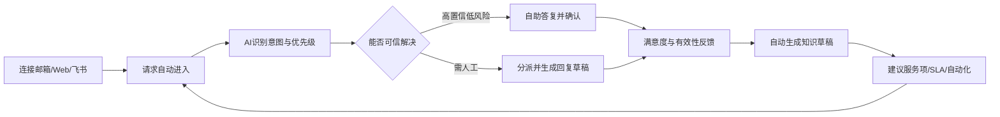

# AI 原生 ITSM SaaS 商业计划书（中国区优先、PLG 模式）

> **工作产品名：灵犀服务台 / Lingxi Service Desk（暂定，正式使用前需完成商标、域名和同名产品检索）**  
> **版本：V1.0**  
> **日期：2026-07-14**  
> **适用阶段：个人工作室起步，验证产品市场匹配后升级为小型产品公司**

---

## 0. 文档定位与重要说明

本计划书不是“传统 ITSM 产品功能清单”，而是一份以中国区首阶段市场、产品驱动增长（PLG）和个人工作室资源边界为前提的创业执行方案。

文中的市场规模、转化率、价格、成本和收入预测分为三类：

1. **外部事实**：来自法规、官方报告、厂商官网和公开产品资料，文末列出来源。
2. **策略判断**：基于外部事实形成的产品与商业推演，需要通过用户访谈和真实产品数据验证。
3. **经营假设**：用于财务测算和阶段决策，不代表已实现结果。

本计划书不构成法律、税务或网络安全合规意见。产品正式上线前，应由中国大陆执业律师、等保与数据合规顾问进行专项审查。

---

# 1. 执行摘要

## 1.1 一句话定位

面向中国 50—500 人成长型企业和 2—15 人内部服务团队，提供一个可以在十分钟内启用、从企业微信/飞书/钉钉/邮箱直接接收请求、由 AI 自动完成分流、答复、知识沉淀和流程执行的轻量化 IT 服务管理 SaaS。

## 1.2 核心机会

中国企业级 SaaS 市场仍在增长，但长期存在四个结构性问题：重定制、重销售、产品复杂、用户难以快速感知价值。中国信通院 2024 年报告指出，2023 年中国 SaaS 市场规模为 581 亿元，同比增长约 23.1%；同时，国内 SaaS 普遍面临定制化导致规模效应不足、产品“大而全”降低易用性、数据安全顾虑和高人力投入等挑战。[S1]

ITSM 领域尤其明显：

- 大型平台覆盖事件、问题、变更、CMDB、自动化、监控等完整体系，但通常依赖咨询、实施和销售推动。
- 轻量工单或客服产品易用，但缺少面向内部 IT 服务的服务目录、SLA、知识闭环、变更控制和服务运营能力。
- 海外 PLG 产品体验较成熟，但在中国区存在数据位置、中文语义、本地 IM、发票支付、售后支持和监管适配等门槛。
- 新一代 AI 产品往往把“聊天机器人”叠加在旧流程上，没有改变系统配置、上线和运营的成本结构。

因此，最有价值的切入点不是再做一个完整 ITIL 套件，而是：

> **用 AI 把“企业群聊、邮箱和零散文档”渐进式升级为可管理的服务体系。**

用户无需先建 CMDB、设计几十条流程或接受咨询实施。系统先从真实请求开始工作，再根据历史数据建议分类、服务项、知识、SLA 和自动化规则。

## 1.3 产品楔子

首个产品楔子定义为：

> **AI 服务收件箱（AI Service Inbox）**

核心价值链：

1. 连接邮箱、Web 表单或一个主流协作平台。
2. 自动识别请求意图、影响、紧急程度和归属团队。
3. 基于知识库生成可核验的回答或工程师回复草稿。
4. 将群聊和邮件转成可追踪工单，并自动同步处理状态。
5. 从已解决请求中生成知识草稿和自动化建议。
6. 逐步启用服务目录、SLA、审批和动作编排。

这使产品的价值获取顺序从“先配置、后使用”变成“先使用、再沉淀、后治理”。

## 1.4 初始目标客户

### 首选 ICP

- 中国大陆企业，员工 50—500 人。
- IT 支持或数字化团队 2—15 人。
- 每月内部请求 100—5,000 单。
- 使用飞书、企业微信、钉钉或企业邮箱。
- 当前主要通过群聊、Excel、OA 表单、共享邮箱或简单工单处理需求。
- 有效率和审计诉求，但尚未准备投入几十万元建设重型 ITSM。
- 决策者通常是 IT 经理、信息化负责人、研发效能负责人或创始人。

### 首阶段优先行业

1. 软件、互联网、SaaS、数字服务企业。
2. 连锁零售和多门店企业的总部 IT 团队。
3. 专业服务、设计、咨询、教育科技企业。
4. 处于数字化扩张期的轻制造企业总部。

### 首阶段主动回避

- 银行、证券、保险、核心政务、军工和高度涉密组织。
- 以私有化交付、信创适配、复杂招投标为前置条件的客户。
- 需要数十条深度定制流程和驻场实施的集团型客户。
- 仅希望购买“聊天机器人”，没有服务管理场景和持续运营责任人的客户。

这些客户并非永远不做，而是不适合个人工作室的 PLG 第一阶段。

## 1.5 商业模式摘要

采用“免费工作区 + 按工作区分层订阅 + AI 用量包 + 少量高价值附加项”的模式。

| 版本 | 建议年付折算价 | 适用对象 | 核心限制 |
|---|---:|---|---|
| Free | ¥0 | 1—3 人服务团队试用 | 3 名坐席、100 工单/月、100 AI 动作/月、1 个入口 |
| Team | ¥299/月/工作区 | 小型 IT 支持团队 | 5 坐席、1,000 工单/月、1,500 AI 动作/月 |
| Growth | ¥899/月/工作区 | 成长型企业 | 15 坐席、5,000 工单/月、8,000 AI 动作/月、SLA/自动化/多入口 |
| Business | ¥2,499/月/工作区 | 中型组织或共享服务团队 | 30 坐席、20,000 工单/月、30,000 AI 动作/月、SSO/审计/高级数据策略 |

建议月付价格比年付折算价高 20%，年付提供约两个月优惠。请求人不计费，避免限制组织内扩散。

## 1.6 三年基础经营目标（经营假设）

| 指标 | 第 1 年 | 第 2 年 | 第 3 年 |
|---|---:|---:|---:|
| 期末付费工作区 | 120 | 600 | 1,800 |
| 年均付费工作区 | 60 | 340 | 1,150 |
| 月均 ARPA | ¥620 | ¥720 | ¥850 |
| 订阅收入 | 约 ¥44.6 万 | 约 ¥293.8 万 | 约 ¥1,173 万 |
| 毛利率目标 | 75% | 80% | 82% |
| 团队规模 | 1—3 人 | 5—8 人 | 10—18 人 |
| 主要目标 | 找到 PMF | 建立可重复增长 | 扩张与平台化 |

此模型不依赖大客户项目收入。若为提升现金流承接私有化或咨询项目，必须设置收入占比上限和标准化边界，避免产品路线被项目牵引。

---

# 2. 创业命题与核心判断

## 2.1 创业命题

企业并不天然需要“ITSM 软件”，企业需要的是：

- 员工遇到问题时知道在哪里求助。
- 服务团队不再被群聊和重复问题淹没。
- 重要请求不会遗漏，有明确责任人和时限。
- 已解决问题能够复用，而不是每次重新处理。
- 管理者能看到服务质量、瓶颈和真实工作量。
- 常见工作能够自动完成，但关键操作仍然可控、可审计。

传统 ITSM 往往从流程和治理出发；本产品应从“请求被更快、更可靠地解决”出发，再逐步形成治理。

## 2.2 五项核心判断

### 判断一：AI 的首要价值不是替代工程师，而是降低 ITSM 的采用成本

AI 应优先解决以下采用障碍：

- 自动识别工单类型，减少用户选表单。
- 自动补齐信息，减少反复追问。
- 自动生成回复和知识草稿，减少文档维护。
- 根据自然语言生成规则和报表，减少管理员配置。
- 从实际工单反推服务目录，而不是要求客户事先设计完整目录。

### 判断二：PLG 在中国 B2B 不是“没有销售”，而是“产品先完成大部分销售工作”

中国区仍会存在合同、发票、数据协议、采购审批和安全问卷。PLG 的目标是：

- 用户在销售介入前已经完成注册、接入、试用和价值验证。
- 低客单价用户可以全自助购买。
- 中高客单价用户只在采购、合规或扩容时接受轻量协助。
- 产品内行为数据决定何时介入，而不是依赖广撒网式销售。

### 判断三：初始产品不应完整覆盖 ITIL

个人工作室若从事件、问题、变更、发布、配置、容量、可用性、供应商、财务等全套流程起步，必然导致：

- 开发周期过长。
- 产品界面复杂。
- 无法形成明确激活路径。
- 需要大量实施和培训。
- AI 价值被功能建设稀释。

第一阶段只做“请求受理—理解—解决—沉淀—改进”的最短闭环。

### 判断四：国产模型成本不再是主要障碍，质量控制与安全治理才是

主流中国云厂商大模型 API 已采用低价按量计费。以公开价格为参考，轻量模型处理数百万 Token 的直接模型成本可控制在几十元以内。[S12] 真正决定产品可用性的因素是：

- 知识检索是否准确。
- 是否提供可追溯引用。
- 是否能识别权限边界。
- 是否对高风险动作要求审批。
- 是否具备持续评估和回归测试。
- 是否能避免跨租户数据泄露。

### 判断五：在中国区，安全与数据控制是产品能力，不是售后材料

中国信通院报告指出，多租户隔离、数据迁移、控制权和云上安全是企业使用 SaaS 的核心顾虑。[S1] 因此必须把以下能力产品化：

- 数据存储位置说明。
- 子处理者清单。
- 数据导出和删除。
- AI 数据使用开关。
- 工作区级保留期。
- 审计日志。
- 敏感字段遮蔽。
- 模型供应商选择与 BYOM 路线。

---

# 3. 中国区市场研究

## 3.1 宏观背景

中国信通院统计，2023 年中国云计算市场规模达到 6,165 亿元，其中公有云 4,562 亿元；同年 SaaS 市场规模为 581 亿元，同比增长约 23.1%。报告认为 AI 原生和大模型规模化应用将带来云计算新一轮增长。[S1]

这并不意味着所有 SaaS 产品都有机会。报告同时揭示：

- 大型客户重定制使产品难以标准化复制。
- 国内 SaaS 容易追求“大而全”，降低易用性。
- 用户体验、数据安全、人才投入和评估标准仍是制约因素。
- AI 被建议用于自动配置、增强搜索、自然语言交互和简化操作。

上述问题与 PLG 型 AI ITSM 的机会高度一致：产品必须小切口、高频使用、快速产生价值，并通过 AI 降低配置和运营成本。

## 3.2 需求驱动因素

### 3.2.1 企业内部请求持续碎片化

企业普遍使用多个协作入口：群聊、私聊、邮箱、OA、电话和口头请求。请求数据无法统一沉淀，服务团队难以统计工作量和响应质量。

### 3.2.2 中小企业 IT 团队人数增长慢于系统复杂度

云服务、SaaS、终端、账号、权限和安全工具越来越多，但内部 IT 团队通常保持精简。重复咨询、账号权限、设备和应用故障占用大量时间。

### 3.2.3 员工对企业软件体验预期提高

用户不愿进入复杂门户、选择多级目录或填写长表单。他们希望像发送消息一样提出问题，并即时得到答复或明确进度。

### 3.2.4 管理要求逐渐从“有人处理”升级到“可追踪、可审计、可改进”

当企业规模扩大、客户审计或体系认证增加时，仅靠群聊无法证明请求是否按时响应、权限是否经过审批、变更是否留痕。

### 3.2.5 AI 为服务自动化提供新交互层

AI 服务台可以理解自然语言、完成分类、推荐答案和执行流程，但必须由规则、权限、审计和人工审批约束。IBM 对 AI 服务台的定义也强调其不仅回答问题，还包括请求分类、自助服务、流程执行和向人工团队升级。[S15]

## 3.3 目标市场分层

| 市场层 | 典型组织 | 采购特点 | 产品适配度 | 第一阶段策略 |
|---|---|---|---|---|
| 微型团队 | 10—50 人 | 决策快、预算低、请求少 | 中 | 免费版获客，不作为主要收入来源 |
| 成长型企业 | 50—500 人 | 有明确痛点、可自助试用、预算可控 | 高 | 核心 ICP |
| 中型企业 | 500—2,000 人 | 关注 SSO、审计、数据和集成 | 中高 | Growth/Business，自助试用后辅助成交 |
| 大型集团 | 2,000 人以上 | 招采、私有化、定制、信创要求多 | 低 | 暂不主动进入 |
| 高监管行业 | 金融、政务、能源核心系统 | 安全审查和实施要求高 | 低 | 后续独立产品线或合作伙伴模式 |

## 3.4 Bottom-up 市场容量模型

由于公开资料缺少统一的中国 ITSM SaaS 细分市场口径，本计划不采用未经验证的单一市场规模数字，而采用可更新的底部模型。

### 可服务市场计算公式

`SAM = 符合 ICP 的组织数量 × 目标渗透率 × 年均合同额`

建立三种情景：

| 情景 | 符合 ICP 的潜在组织 | 5 年目标渗透率 | 年均合同额 | 对应年收入空间 |
|---|---:|---:|---:|---:|
| 保守 | 50,000 | 1% | ¥8,000 | ¥4,000 万 |
| 基准 | 150,000 | 2% | ¥10,000 | ¥3 亿元 |
| 进取 | 300,000 | 3% | ¥12,000 | ¥10.8 亿元 |

这些数字是经营假设，首阶段不应以 TAM 说服自己，而应验证以下更关键事实：

- 目标团队是否愿意在 30 分钟内连接真实入口。
- 是否在 7 天内处理至少 20 个真实请求。
- 是否愿意为 SLA、自动化、AI 配额和数据能力付费。
- 是否无需定制和人工实施即可持续使用。

## 3.5 购买与使用角色

| 角色 | 目标 | 担忧 | 产品必须回答的问题 |
|---|---|---|---|
| IT 经理/信息化负责人 | 提效、规范、可视化 | 上线成本、数据安全、团队抵触 | 多久见效？是否需要实施？数据在哪里？ |
| 服务台负责人 | 降低积压和重复工作 | AI 不准确、流程被打断 | 能否控制自动化？能否随时人工接管？ |
| 一线工程师 | 快速处理请求 | 增加录入负担 | 是否减少操作而非增加操作？ |
| 普通员工 | 快速解决问题 | 不想学习新系统 | 能否在已有 IM 中直接使用？ |
| 财务/采购 | 价格可预测、合同合规 | 用量失控、续费涨价 | 费用是否透明？AI 如何计量？ |
| 安全/法务 | 数据和责任可控 | 跨境、模型训练、泄露 | 是否支持删除、导出、审计和供应商披露？ |

---

# 4. 竞争格局与战略空位

## 4.1 竞品分类

### A. 大型企业 ITSM/ESM 平台

代表：ServiceNow、Ivanti，以及国内面向中大型政企的一体化运维厂商。

优势：流程完整、平台能力强、适合复杂组织。  
弱点：成本高、上线慢、通常依赖咨询实施，不适合个人工作室正面竞争。

### B. 海外 PLG 或中端 ITSM SaaS

代表：Jira Service Management、Freshservice、ManageEngine ServiceDesk Plus。

- Jira Service Management 提供免费档并按代理坐席收费，具备成熟的服务管理和研发协同能力。[S16]
- Freshservice 以每坐席订阅和较快上手著称，并提供 AI Agent 配额。[S17]
- ManageEngine 提供免费 IT 帮助台版本及云/本地部署选项。[S7][S18]

优势：产品成熟、价格透明、试用路径明确。  
弱点：中国区本地协作入口、数据位置、中文知识运营、发票和本地支持不是其天然优势。

### C. 国内 ITSM 与智能服务平台

代表：轻帆云、AskBot、甄知、WeOps/EasyOps 等。

公开资料显示，这些产品通常具备 ITIL 流程、知识库、资产/CMDB、低代码、AI 问答或智能分派能力。[S6][S8][S9] 其优势是本地化、行业经验和私有化能力；但多数官网仍以“申请演示、咨询方案、免费试用”为主要转化方式，透明定价和完全自助配置相对有限。

### D. 客服和通用工单 SaaS

代表：Udesk、Zoho Desk、逸创云客服等。

优势：多渠道、客服体验、工单能力成熟。  
弱点：产品核心围绕外部客户服务，内部服务目录、变更、资产关系、服务运营和 IT 语义不够深入。

### E. AI 原生服务管理

代表：Atomicwork 等。

Atomicwork 将 AI Coworker 与 ITSM/ESM 结合，但公开起售价为每年 25,000 美元，更偏向中大型企业。[S10][S11]

## 4.2 竞争矩阵

> 表中判断用于产品战略，不代表对竞品全部版本的完整审计，需每季度复核。

| 类型 | 自助注册 | 中国 IM | AI 原生 | 完整 ITSM | 私有化 | 透明价格 | 初始用户负担 |
|---|---|---|---|---|---|---|---|
| 大型 ITSM 平台 | 低 | 需集成 | 中高 | 高 | 高 | 低 | 高 |
| 海外 PLG ITSM | 高 | 弱/需开发 | 中高 | 中高 | 部分 | 高 | 中 |
| 国内企业 ITSM | 中低 | 高 | 中 | 高 | 高 | 低 | 高 |
| 通用工单/客服 | 高 | 高 | 中 | 低 | 部分 | 中 | 低 |
| 本产品目标 | 高 | 高 | 高 | 先轻后深 | 后续 | 高 | 极低 |

## 4.3 战略空位

本产品应占据的空位是：

> **中国本地协作生态中的、面向成长型企业的、AI 原生且完全可自助启用的内部服务管理产品。**

差异化不依赖单个 AI 功能，而依赖完整的采用模型：

1. 不要求先建设流程体系。
2. 从真实消息和邮件自动形成结构化服务数据。
3. 自动建议而非强迫用户配置。
4. AI 输出可引用、可审批、可回退、可评估。
5. 产品内完成注册、接入、激活、付费和扩容。
6. 中国区数据、模型、IM、支付、发票和监管适配前置设计。

## 4.4 护城河设计

### 护城河一：服务语义数据闭环

随着工单、知识、反馈、自动化和组织上下文积累，产品形成高质量的“服务语义图谱”：谁在什么场景提出什么请求、需要哪些信息、由谁解决、使用什么知识、执行了什么动作、结果是否有效。

### 护城河二：面向中国企业的服务模板市场

沉淀可直接安装的模板：

- 账号开通/离职回收。
- 软件安装和权限申请。
- 门店网络与终端故障。
- 新员工入职服务包。
- 设备领用和维修。
- SaaS 应用访问申请。
- 研发环境和发布支持。

模板应包含意图识别、字段补齐、SLA、审批、知识和自动化动作，而不是只有一张表单。

### 护城河三：安全可控的 Agent 执行层

构建基于策略的工具执行框架：AI 只能在授权范围内调用工具；高风险操作必须审批；所有动作可追踪和撤销。随着连接器和策略库增加，产品从工单工具升级为服务执行平台。

### 护城河四：PLG 数据与增长系统

围绕激活、协作扩散、AI 成功率和价值证明形成产品数据资产。竞争者可以复制功能，但难以快速复制经过大量实验优化的自助上手路径。

---

# 5. 产品战略

## 5.1 产品原则

1. **十分钟获得第一价值。**
2. **不要求普通员工学习新入口。**
3. **默认建议，不默认自治。**
4. **AI 结论必须可解释、可反馈。**
5. **复杂能力渐进呈现。**
6. **配置本身也应由 AI 辅助。**
7. **任何数据都可导出和删除。**
8. **拒绝为单一客户形成不可复用分支。**

## 5.2 首阶段产品闭环

## 5.3 MVP 必须包含

- 工作区注册、邀请和权限。
- Web 请求入口和邮件接入。
- 至少一个中国主流 IM 接入，建议首选飞书。
- 请求/工单统一收件箱。
- AI 分类、摘要、优先级建议和分派建议。
- 知识库导入、检索、引用式回答。
- 工程师回复草稿。
- 工单解决后生成知识草稿。
- 基础 SLA、状态、标签和报表。
- 产品内付费、配额和升级。
- 审计日志、数据导出和删除。
- 产品分析埋点和 AI 评估。

## 5.4 MVP 明确不做

- 完整 CMDB 和自动发现。
- 复杂变更委员会和发布管理。
- 监控、日志、链路追踪。
- 远程控制和终端管理。
- 自研基础大模型。
- 每客户独立部署。
- 通用低代码 BPM 平台。
- 面向所有企业部门的 ESM 大而全方案。

## 5.5 版本演进

### 阶段 1：AI Service Inbox

解决请求统一、AI 分流、回答和知识闭环。

### 阶段 2：Service Workflow

增加服务目录、审批、SLA、规则编排、账号/权限/通知连接器。

### 阶段 3：Agentic Service Operations

支持受控的 AI 动作执行、事件聚类、跨系统编排和服务运营建议。

### 阶段 4：Enterprise Service Management

扩展 HR、行政、财务、法务等内部共享服务，但仍保持相同服务内核。

---

# 6. PLG 增长模型

## 6.1 北极星指标

建议北极星指标为：

> **每周被验证有效的解决数（Weekly Verified Resolutions, WVR）**

定义：请求人确认解决，或在设定观察期内未重新打开，且处理过程完整留痕的请求数量。

辅助拆分：

- AI 自助解决数。
- AI 辅助人工解决数。
- 纯人工解决数。
- 首次解决率。
- 重开率。
- 每个有效解决的成本和时间。

不建议把“工单数”“AI 调用数”作为北极星，因为它们可能鼓励更多问题或无效使用。

## 6.2 激活定义

工作区在 24 小时内完成以下 4 项中的至少 3 项，即视为激活：

1. 连接一个真实请求入口。
2. 导入至少一个知识源或创建 5 篇知识。
3. 接收至少 5 个真实请求。
4. 完成至少 1 个 AI 辅助或 AI 自助解决。

## 6.3 PLG 漏斗

## 6.4 关键目标值

以下为内部目标，而非行业保证：

| 指标 | Alpha | 公测后 6 个月 | PMF 阶段 |
|---|---:|---:|---:|
| 注册→连接入口 | 25% | 40% | 55% |
| 连接入口→首个真实请求 | 50% | 70% | 80% |
| 24 小时激活率 | 15% | 30% | 40% |
| 激活工作区 30 日付费率 | 5% | 8% | 12% |
| 全部注册 30 日付费率 | 1% | 3% | 5% |
| D30 激活工作区留存 | 35% | 50% | 65% |
| 月度 Logo 流失率 | — | <3% | <2% |
| AI 建议采纳率 | 40% | 60% | 70% |
| AI 自助答案有效率 | 70% | 80% | 88% |

## 6.5 产品内增长回路

### 协作回路

工程师邀请请求人、审批人和其他团队成员；每个已安装的 IM 应用自然触达更多员工。

### 内容回路

已解决请求形成知识，知识提高 AI 解答率，解答率提高产品价值，进一步促使用户导入更多内容。

### 模板回路

用户安装模板后更快激活；匿名聚合的使用反馈帮助优化模板；优质模板带来更多自然搜索和分享。

### 价值证明回路

系统自动生成“本月节省工时、重复请求减少、SLA 改善、AI 解决率”报告，帮助管理员向负责人证明价值并升级。

## 6.6 免费版设计原则

免费版不是阉割版演示，而是必须能完成完整闭环，但限制规模和高级治理能力。

免费版应保留：

- 真正的请求处理。
- AI 分类和少量回答。
- 知识库。
- 基础报表。
- 一个入口。

付费触发应来自真实增长：

- 更多入口。
- 更多坐席和请求量。
- SLA 和自动化。
- AI 配额。
- SSO、审计、数据策略。
- 更长历史和高级分析。

---

# 7. 中国区获客与市场进入

## 7.1 初始市场进入策略

第一阶段不做大规模品牌广告，也不依赖渠道代理。采用“问题内容 + 免费工具 + 模板 + 社区案例”的开发者式增长。

### 核心渠道

1. 搜索内容：企业微信群工单化、飞书服务台、内部 IT 工单、AI ITSM、SLA 模板等高意图关键词。
2. 模板内容：免费提供可复制的 IT 服务目录、SLA、入离职流程和知识模板。
3. 免费诊断：上传匿名工单 CSV，生成服务效率分析和 AI 自动化机会报告。
4. 产品水印：免费版请求状态页和机器人消息保留轻量品牌标识。
5. 社区：飞书/钉钉开发者社区、运维社区、SaaS 创业社区、少数派式工具内容渠道。
6. 生态市场：飞书应用目录、钉钉应用市场、企业微信服务商生态，按接入成熟度逐步上架。
7. 用户推荐：邀请另一个工作区获得 AI 配额或付费折扣。

## 7.2 内容战略

内容不应泛泛谈“数字化转型”，而应直接解决具体问题：

- 50 人公司是否需要 ITSM。
- 如何把飞书群里的 IT 请求变成工单。
- 如何设计 10 个最常用的内部 IT 服务项。
- AI 自动回复如何避免幻觉。
- 中小企业 IT 服务 SLA 模板。
- 离职账号回收检查清单。
- 从共享邮箱迁移到服务台的 7 天方案。
- 如何计算 IT 支持团队的真实工作量。

每篇内容都应提供可安装模板或直接进入产品的深链接。

## 7.3 销售辅助边界

满足以下任一条件时可以触发人工协助：

- 工作区超过 20 坐席。
- 需要 SSO、安全问卷、DPA 或法务条款。
- 月工单量超过 10,000。
- 需要多个组织或数据隔离域。
- 需要采购合同和对公付款。

人工协助必须基于产品使用数据，避免无效线索跟进。

## 7.4 客户成功模式

- Free/Team：文档、产品内引导和社区支持。
- Growth：工作日在线支持、每季度自动健康报告。
- Business：明确响应 SLA、上线评审和轻量成功计划。

禁止提供无限制的个性化实施。任何高频需求应产品化为模板、连接器或配置项。

---

# 8. 定价、计量与单位经济模型

## 8.1 为什么采用工作区分层，而非纯坐席计费

纯坐席计费会抑制团队协作和邀请。工作区套餐具备以下优势：

- 采购容易预测。
- 允许多个兼职处理人参与。
- 与服务量、AI 用量和治理能力更直接相关。
- 可通过套餐升级自然扩张。

坐席上限仍用于区分规模，超出后按增量坐席收费。

## 8.2 AI 动作定义

为了让费用可预测，定义“AI 动作”而非直接展示 Token：

- 分类/摘要：0.2 个动作。
- 回复草稿：1 个动作。
- 知识问答：1 个动作。
- 知识生成：1 个动作。
- 复杂分析或多工具执行：3—10 个动作。

后台仍记录 Token、模型、缓存命中和实际成本，用于成本治理。

## 8.3 参考单位成本

假设每月处理 1,000 个请求，每个请求平均触发 5 次模型调用，平均总输入 1,500 Token、输出 300 Token：

- 月输入约 750 万 Token。
- 月输出约 150 万 Token。
- 按公开的国产通用模型 API 价格估算，直接模型费用可能约为十几到几十元，具体取决于模型、上下文、缓存和推理模式。[S12]
- 加上向量检索、对象存储、数据库、日志、消息和备份，早期单个活跃工作区的总变动成本可控制在约 ¥30—¥150/月。

因此，AI 成本不是定价的唯一依据。价格应反映服务价值、安全、持续开发、支持和组织级治理能力。

## 8.4 毛利保护机制

- 按任务路由模型：分类使用轻量模型，复杂推理使用高能力模型。
- 缓存相同知识答案。
- 对长文档先切片、摘要和结构化，而非每次全量注入。
- 限制无限循环 Agent。
- 每工作区设置预算、速率和异常告警。
- 高成本工具调用单独计量。
- 提供 BYOM，但收取平台编排和安全治理费用。

---

# 9. 财务计划

## 9.1 启动预算

### 0—6 个月个人工作室预算

| 项目 | 建议预算 |
|---|---:|
| 云资源、域名、邮件、监控 | ¥20,000—¥50,000 |
| 设计、前端组件和品牌 | ¥10,000—¥30,000 |
| 法律、隐私政策、合同模板 | ¥20,000—¥50,000 |
| 安全测试与顾问 | ¥20,000—¥60,000 |
| 内容、社区和小额投放 | ¥20,000—¥50,000 |
| 兼职开发/测试支持 | ¥50,000—¥150,000 |
| 预备金 | ¥30,000—¥60,000 |
| **合计** | **约 ¥15 万—¥40 万** |

若创始人不能全职，应显著延长里程碑，不建议通过快速外包堆人缩短周期，因为核心产品和 AI 评估能力必须掌握在内部。

## 9.2 三年基础损益模型

| 项目 | 第 1 年 | 第 2 年 | 第 3 年 |
|---|---:|---:|---:|
| 订阅与用量收入 | 44.6 万 | 293.8 万 | 1,173 万 |
| 云与模型直接成本 | 8.9 万 | 58.8 万 | 211 万 |
| 毛利 | 35.7 万 | 235 万 | 962 万 |
| 研发与人员 | 60 万 | 220 万 | 600 万 |
| 市场与销售 | 12 万 | 80 万 | 220 万 |
| 管理、法务、安全 | 10 万 | 35 万 | 80 万 |
| 经营利润 | -46.3 万 | -100 万 | 62 万 |

这是“控制增长、第三年接近盈亏平衡”的基础模型。若创始人不计薪或收入增长更快，可提前平衡；若过早招聘销售和实施团队，亏损会扩大。

## 9.3 现金流策略

- 鼓励年付，改善现金流和留存。
- 免费版设置资源上限，避免大量无效租户消耗。
- 不通过永久低价锁定早期客户，可提供 12—24 个月创始用户折扣。
- 咨询和迁移服务必须标准化、固定范围、预付费。
- 不承诺不可预测的无限 AI 使用。

## 9.4 经营预警线

| 预警指标 | 阈值 | 动作 |
|---|---:|---|
| 激活率 | 连续 4 周 <15% | 停止加功能，重做 onboarding |
| AI 有效率 | <70% | 降低自治范围，修复知识与评估 |
| 免费转付费 | <1% | 重新定义付费触发和 ICP |
| 月度 Logo 流失 | >4% | 暂停获客，做流失访谈 |
| 单工作区支持时长 | >2 小时/月 | 产品化高频问题，限制服务边界 |
| 非标需求收入占比 | >25% | 拒绝或转合作伙伴交付 |
| 毛利率 | <70% | 优化模型路由、配额和套餐 |

---

# 10. 技术与产品架构策略

## 10.1 架构原则

- 初期采用模块化单体，不上微服务和 Kafka。
- 多租户隔离从第一天设计。
- 所有写操作具有审计记录。
- AI 模型通过统一适配层调用。
- 使用事务 Outbox 保证业务事件可靠投递。
- 连接器与核心域解耦。
- 任何自动化动作必须经过策略引擎。

## 10.2 推荐初始技术栈

| 层 | 建议 |
|---|---|
| Web | Next.js / React / TypeScript |
| API | NestJS 或 FastAPI，优先团队最熟悉技术 |
| 数据库 | PostgreSQL + Row Level Security 或显式 tenant_id 隔离 |
| 缓存/队列 | Redis + BullMQ/Celery |
| 搜索/向量 | 初期 PostgreSQL pgvector，规模扩大后再拆分 |
| 对象存储 | 阿里云 OSS/腾讯云 COS/S3 兼容接口 |
| 身份 | 自建邮箱登录 + OIDC/SAML 后续扩展 |
| 监控 | OpenTelemetry + 托管日志/APM |
| 部署 | 中国大陆单区域容器服务，IaC 管理 |
| AI | 模型网关 + 多模型路由 + RAG + 工具策略层 |

## 10.3 为什么不应过早私有化

私有化会引入版本分叉、升级、交付、环境兼容和现场支持。第一阶段应坚持：

- 只提供多租户 SaaS。
- Business 可提供独立数据库或专属密钥，但仍由同一平台运营。
- 当 SaaS 年经常性收入达到明确门槛、出现可重复私有化需求后，再开发标准化单租户版本。

---

# 11. 中国区合规与可信策略

## 11.1 基础法规框架

产品至少需要评估并遵守：

- 《中华人民共和国个人信息保护法》。[S2]
- 《中华人民共和国数据安全法》。[S3]
- 《中华人民共和国网络安全法》及相关现行规定。[S4]
- 《网络数据安全管理条例》，自 2025 年 1 月 1 日起施行。[S5]
- 网络安全等级保护相关标准 GB/T 22239-2019。[S13]
- 《生成式人工智能服务管理暂行办法》。[S14]
- 《人工智能生成合成内容标识办法》，自 2025 年 9 月 1 日起施行。[S19]

官方答记者问说明，企业、教育科研机构等研发和应用生成式 AI、但未向境内公众提供服务的情形，不适用《生成式人工智能服务管理暂行办法》；但面向公众提供生成式 AI 服务时，需要进一步评估备案、登记和内容治理义务。[S20]

截至 2026 年 4 月 30 日，国家网信办公告累计 868 款生成式 AI 服务完成备案、530 款应用或功能完成登记；通过 API 调用已备案模型的应用仍可能涉及属地登记和展示模型信息等要求，需在上线前与属地主管部门或专业顾问确认。[S21]

## 11.2 产品级合规能力

- 明确的数据处理协议和隐私政策。
- 用户同意、授权与撤回机制。
- 最小必要信息收集。
- 数据访问、更正、导出和删除能力。
- 工作区管理员配置保留期。
- 子处理者与模型供应商公示。
- 不使用客户数据训练公共模型的默认承诺。
- 敏感信息检测和掩码。
- AI 输出标识及元数据记录。
- 安全事件响应流程和通知机制。
- 数据跨境功能默认关闭。

## 11.3 分级自治策略

| 风险级别 | 示例 | 默认策略 |
|---|---|---|
| R0 信息生成 | 摘要、分类、回复草稿 | 可自动执行，保留日志 |
| R1 低风险答复 | 引用已审批知识回答常见问题 | 高置信度自动，允许人工接管 |
| R2 可逆动作 | 建群、发送通知、创建账号申请单 | 规则授权后执行 |
| R3 业务写操作 | 修改权限、重置密码、停用账号 | 必须审批或强认证 |
| R4 高风险动作 | 删除数据、生产变更、资金相关 | 不由通用 Agent 自动执行 |

---

# 12. 组织与人员计划

## 12.1 创始人阶段角色

创始人需要同时承担：

- 产品经理：用户研究、范围控制、指标设计。
- 架构负责人：核心域、多租户、安全和 AI 评估。
- 增长负责人：内容、 onboarding 和转化实验。
- 客户成功：直接观察用户行为和问题。

不建议首位全职员工是销售。优先级应是：

1. 全栈工程师或产品工程师。
2. 兼具交互和前端能力的设计工程师。
3. 测试/安全/运维支持。
4. 在 PMF 后再引入增长和商务。

## 12.2 外包边界

可外包：品牌视觉、部分前端组件、法律文本初稿、安全测试、内容排版。  
不可外包：核心数据模型、多租户权限、AI 评估、策略引擎、产品分析、客户洞察。

---

# 13. 分阶段路线图

## 13.1 0—4 周：问题验证

- 访谈 30 个目标团队。
- 收集 10 份匿名工单、群聊或共享邮箱样本。
- 验证高频请求和实际处理路径。
- 制作可点击原型和 AI 演示。
- 获取至少 5 个设计伙伴。

退出条件：至少 60% 访谈对象确认请求碎片化是高频痛点，5 家愿意提供真实数据并试用。

## 13.2 5—12 周：可用 Alpha

- 工作区、用户和基础权限。
- Web/邮件入口。
- 工单收件箱。
- AI 分类、摘要和回复草稿。
- 文档导入和 RAG。
- 基础分析和审计。

退出条件：3 家设计伙伴连续使用两周，至少处理 200 个真实请求。

## 13.3 13—20 周：私测 Beta

- 飞书机器人与事件接入。
- 服务目录 Lite。
- SLA 和自动化规则。
- 知识生成与审批。
- 配额和计费。
- 数据导出、删除、保留策略。

退出条件：10 家活跃工作区，AI 建议采纳率 >50%，至少 3 家付费。

## 13.4 21—28 周：公开 Beta

- 自助注册、模板和产品内引导。
- 推荐邀请和试用升级。
- 钉钉或企业微信第二入口。
- 状态页、API、Webhook。
- 安全和隐私材料。

退出条件：100 个注册工作区，30 个激活，10 个付费，D30 激活留存 >40%。

## 13.5 29—52 周：PMF 搜索

- 重点优化一个行业或组织类型。
- 上线受控动作连接器。
- 强化报告、扩容和团队协作。
- 形成内容和模板增长引擎。
- 完成基础等保定级评估和安全体系建设。

---

# 14. 用户研究与验证计划

## 14.1 访谈样本配额

| 类型 | 数量 | 目的 |
|---|---:|---|
| 50—200 人科技企业 IT 负责人 | 10 | 验证 PLG 和飞书场景 |
| 200—500 人制造/零售 IT 负责人 | 8 | 验证多地点和终端场景 |
| 一线工程师 | 8 | 验证工作台和 AI 辅助 |
| 普通员工 | 6 | 验证入口和提单体验 |
| 已使用 ITSM 的管理员 | 5 | 识别迁移和替代障碍 |
| 放弃过 ITSM 的团队 | 5 | 识别采用失败原因 |

## 14.2 必问问题

- 最近一次请求是从哪里进入的？
- 从提出到解决经历了哪些人和系统？
- 哪些信息总是缺失？
- 哪些问题重复最多？
- 当前如何衡量服务质量？
- 什么情况下必须审批？
- 过去为什么没有上线或持续使用工单系统？
- 允许 AI 自动做到哪一步？
- 什么数据绝不能发送给外部模型？
- 愿意为哪些结果付费，而不是为哪些功能付费？

## 14.3 付费验证

不要只询问“是否愿意付费”，而要依次验证：

1. 是否愿意连接真实入口。
2. 是否愿意导入真实知识。
3. 是否愿意邀请同事。
4. 是否愿意签署试用协议。
5. 是否愿意支付可退的小额设计伙伴费用。
6. 是否愿意年付换取折扣。

---

# 15. 风险与应对

| 风险 | 可能后果 | 应对策略 |
|---|---|---|
| 用户认为现有群聊已够用 | 激活低 | 用遗漏率、响应时间和重复请求报告证明价值 |
| AI 回答错误 | 信任受损 | 引用式回答、置信度门控、人工确认和快速反馈 |
| 产品变成重型 ITSM | 开发失控 | 设立明确非目标和版本准入委员会 |
| 大客户定制诱惑 | 失去 PLG 路线 | 非标收入上限 25%，只做可复用能力 |
| 中国区合规不确定 | 上线或销售受阻 | 使用备案模型、属地咨询、保守数据策略 |
| IM 平台接口变化 | 入口中断 | 连接器隔离、邮件/Web 兜底、自动兼容测试 |
| 免费用户成本失控 | 毛利下降 | 激活前限额、休眠租户归档、AI 预算控制 |
| 创始人精力不足 | 交付延迟 | 缩小首入口和首场景，拒绝同时开发三大 IM |
| 大厂快速复制 | 差异化减弱 | 深耕服务语义、模板、增长体验和执行治理 |
| 客户数据不足 | AI 效果差 | 预置知识模板、工单补全、冷启动规则和人工反馈 |

---

# 16. 关键决策门（Go/No-Go）

## Gate 1：问题成立

- 30 次访谈完成。
- 5 家设计伙伴。
- 至少 3 家提供真实数据。

未满足：调整 ICP 或停止开发。

## Gate 2：产品可用

- 连续处理 200 个真实请求。
- 核心路径无人工实施仍可运行。
- AI 建议采纳率 >40%。

未满足：修复体验和 AI，不扩功能。

## Gate 3：付费成立

- 10 家活跃工作区。
- 3—5 家真实付费。
- 付费原因与预设价值一致。

未满足：重新设计套餐、付费触发或 ICP。

## Gate 4：增长可重复

- 每月新增激活工作区持续增长。
- 至少 30% 新注册来自自然内容、模板或推荐。
- 付费回收期可控制在 12 个月内。

未满足：不扩张团队和广告投入。

---

# 17. 未来 90 天执行清单

## 第 1—2 周

- 确定工作名、域名候选和品牌边界。
- 建立用户访谈数据库。
- 完成 10 次访谈。
- 收集真实请求样本并脱敏。
- 输出问题频率和价值矩阵。

## 第 3—4 周

- 制作端到端可点击原型。
- 实现离线 AI 工单分析演示。
- 建立产品官网和候补名单。
- 招募 5 家设计伙伴。
- 明确数据处理和试用协议。

## 第 5—8 周

- 开发多租户、用户、工单、知识核心。
- 接入邮箱和 Web 表单。
- 实现 AI 分类、摘要、回复草稿和引用式问答。
- 接入产品分析和 AI 评估。

## 第 9—12 周

- 与 3 家设计伙伴处理真实请求。
- 每周复盘失败案例。
- 建立知识草稿和反馈闭环。
- 设计飞书接入。
- 验证首个付费报价。

---

# 18. 最终建议

## 18.1 应该做

- 做“十分钟启用的 AI 服务收件箱”。
- 先服务成长型企业，不先攻大客户。
- 先做飞书/邮箱/Web，再逐步覆盖企业微信和钉钉。
- 让 AI 降低配置和运营成本，而不只是聊天。
- 用工作区套餐和透明配额建立可预测价格。
- 从第一天建设数据隔离、审计和 AI 评估。
- 用真实使用和付费数据决定路线。

## 18.2 不应该做

- 不要复制 ServiceNow 的功能地图。
- 不要在 MVP 做完整 CMDB、监控和自动化平台。
- 不要承接无法复用的定制开发。
- 不要把“模型更强”当成核心护城河。
- 不要在没有激活和留存前大量投放。
- 不要同时为三大 IM 做完整深度集成。
- 不要承诺 AI 全自动解决所有问题。

## 18.3 最值得验证的产品口号

> **把企业群聊和邮箱，十分钟升级成 AI 服务台。**

备选：

- “不用实施，也能开始的 AI ITSM。”
- “先解决请求，再长出体系。”
- “让每一次服务都可追踪、可复用、可自动化。”

---

# 19. 资料来源

- **[S1]** 中国信息通信研究院，《中国企业级 SaaS 产业发展研究报告（2024 年）》：https://www.caict.ac.cn/kxyj/qwfb/ztbg/202408/P020240815374016912879.pdf
- **[S2]** 国家互联网信息办公室，《中华人民共和国个人信息保护法》：https://www.cac.gov.cn/2021-08/20/c_1631050028355286.htm
- **[S3]** 国家能源局法规页面，《中华人民共和国数据安全法》：https://prpq.nea.gov.cn/pfzt/7347.html
- **[S4]** 国家互联网信息办公室，《中华人民共和国网络安全法》：https://www.cac.gov.cn/2025-12/29/c_1768735112911946.htm
- **[S5]** 国家互联网信息办公室，《网络数据安全管理条例》：https://www.cac.gov.cn/2024-09/30/c_1729384452307680.htm
- **[S6]** 轻帆云官网，智能 ITSM：https://www.qingfanyun.com/
- **[S7]** ManageEngine 中国，免费 ITSM/ServiceDesk Plus：https://www.manageengine.cn/products/service-desk/free-it-help-desk-software.html
- **[S8]** AskBot 智能工单与 ITSM：https://www.askbot.cn/ticket/
- **[S9]** 甄知科技 ITSM：https://www.zknow.com/solution.html
- **[S10]** Atomicwork 官网：https://www.atomicwork.com/
- **[S11]** Atomicwork 定价：https://www.atomicwork.com/pricing
- **[S12]** 阿里云百炼模型价格：https://help.aliyun.com/zh/model-studio/model-pricing
- **[S13]** 国家标准全文公开系统，GB/T 22239-2019：https://openstd.samr.gov.cn/bzgk/std/newGbInfo?hcno=BAFB47E8874764186BDB7865E8344DAF
- **[S14]** 国家互联网信息办公室，《生成式人工智能服务管理暂行办法》：https://www.cac.gov.cn/2023-07/13/c_1690898327029107.htm
- **[S15]** IBM，《什么是 AI 服务台》：https://www.ibm.com/cn-zh/think/topics/ai-service-desk
- **[S16]** Atlassian Service Collection 定价：https://www.atlassian.com/collections/service/pricing
- **[S17]** Freshservice 定价：https://www.freshworks.com/freshservice/pricing/
- **[S18]** ManageEngine ServiceDesk Plus 定价：https://www.manageengine.com/products/service-desk/pricing.html
- **[S19]** 国家互联网信息办公室，《人工智能生成合成内容标识办法》：https://www.cac.gov.cn/2025-03/14/c_1743654684782215.htm
- **[S20]** 国家互联网信息办公室，《生成式人工智能服务管理暂行办法》答记者问：https://www.cac.gov.cn/2023-07/13/c_1690898326863363.htm
- **[S21]** 国家互联网信息办公室，2026 年 3—4 月生成式人工智能服务备案公告：https://www.cac.gov.cn/2026-05/13/c_1780413225190669.htm
- **[S22]** 飞书开放平台事件订阅：https://open.feishu.cn/document/server-docs/event-subscription-guide/overview?lang=zh-CN
- **[S23]** 钉钉开放平台事件推送：https://open.dingtalk.com/document/development/configure-stream-push

---

**文档结束**
