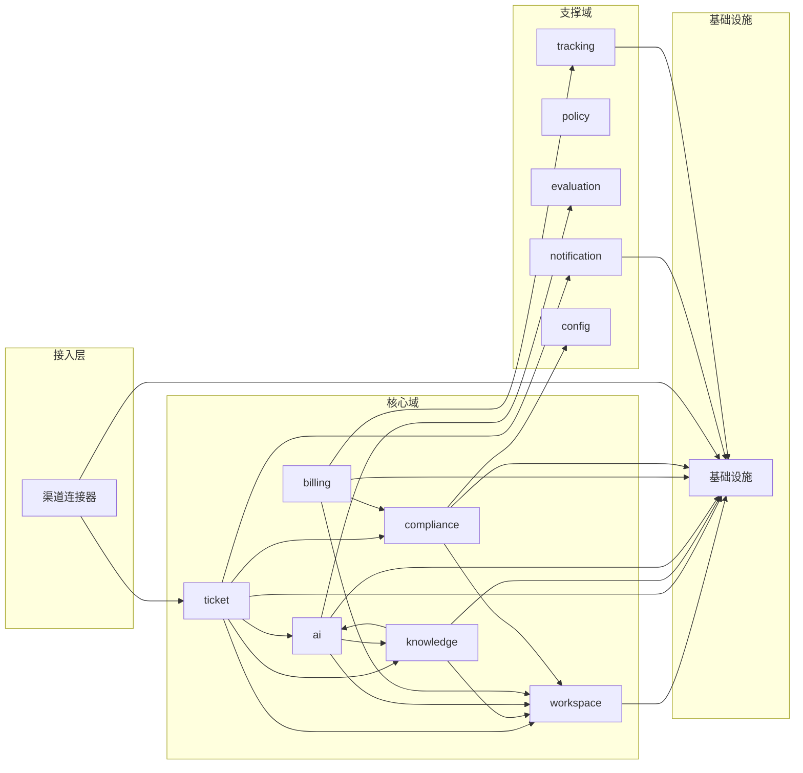

# 模块边界定义

> **工作产品名：灵犀服务台 / Lingxi Service Desk**  
> **版本：V1.0**  
> **日期：2026-07-14**  
> **架构风格：模块化单体**

---

## 1. 模块划分原则

| 原则 | 说明 |
|---|---|
| 按领域划分 | 每个模块对应一个清晰的业务领域 |
| 高内聚低耦合 | 模块内部紧密相关，模块间依赖最小化 |
| 显式依赖方向 | 依赖方向从具体到抽象，核心域不依赖接入层 |
| 单一职责 | 每个模块只负责一个主要功能 |
| 可独立测试 | 模块可单独进行单元测试和集成测试 |
| 工作区隔离 | 所有业务模块必须支持 workspace_id 过滤 |

---

## 2. 模块结构

```
src/
├── app/                    # 应用入口和配置
│   ├── main.ts
│   ├── config/
│   └── bootstrap/
├── domains/                # 核心域模块
│   ├── workspace/          # 工作区与身份
│   ├── ticket/             # 工单域
│   ├── knowledge/          # 知识域
│   ├── ai/                 # AI 服务域
│   ├── billing/            # 商业化域
│   └── compliance/         # 合规与审计域
├── channels/               # 渠道连接器
│   ├── feishu/
│   ├── email/
│   └── web/
├── support/                # 支撑服务
│   ├── notification/
│   ├── policy/
│   ├── evaluation/
│   ├── tracking/
│   └── config/
├── infrastructure/         # 基础设施适配
│   ├── database/
│   ├── cache/
│   ├── queue/
│   ├── storage/
│   └── external/
├── shared/                 # 共享工具和类型
│   ├── types/
│   ├── utils/
│   ├── decorators/
│   └── guards/
└── interfaces/             # API 接口层
    ├── rest/
    └── graphql/            # 后续扩展
```

---

## 3. 模块边界详细定义

### 3.1 工作区与身份域（workspace）

**职责边界**：
- 创建和管理工作区
- 用户注册和认证
- 成员邀请和角色分配
- 基础 RBAC 权限控制

**输入**：
- 用户注册请求
- 工作区配置
- 成员邀请信息

**输出**：
- 工作区实体
- 用户实体
- 权限验证结果

**依赖**：
- 基础设施：数据库

**被依赖**：
- 所有业务模块（权限验证）

**禁止**：
- 处理工单业务逻辑
- 直接操作知识内容
- 调用 AI 模型

### 3.2 工单域（ticket）

**职责边界**：
- 请求接收和结构化
- 工单生命周期管理
- 状态机流转
- SLA 计算和监控
- 工单关系管理

**输入**：
- 来自渠道的原始请求
- AI 分类和摘要结果
- 坐席操作指令

**输出**：
- 工单实体
- SLA 状态
- 通知事件

**依赖**：
- workspace（权限验证）
- ai（分类和摘要）
- knowledge（关联知识）
- compliance（审计日志）

**被依赖**：
- notification（发送通知）
- billing（用量计量）
- tracking（事件追踪）

**禁止**：
- 直接处理用户认证
- 修改知识内容
- 调用外部模型

### 3.3 知识域（knowledge）

**职责边界**：
- 文档导入和解析
- 知识切片和向量化
- 知识检索和引用
- 知识生命周期管理
- 知识权限控制

**输入**：
- 文档上传请求
- 检索查询
- 知识草稿

**输出**：
- 知识文档实体
- 检索结果（含引用）
- 向量索引更新

**依赖**：
- workspace（权限验证）
- ai（向量化和生成）
- infrastructure（对象存储、向量检索）

**被依赖**：
- ticket（关联知识）
- ai（RAG 检索）

**禁止**：
- 处理工单状态流转
- 直接发送通知
- 管理用户权限

### 3.4 AI 服务域（ai）

**职责边界**：
- AI Gateway：统一模型调用入口
- 任务路由：根据任务类型选择模型
- RAG 流程：检索、重排、生成、引用验证
- 置信度计算和风险门控
- AI 评估和反馈收集

**输入**：
- 分类请求
- 摘要请求
- 回答请求
- 反馈数据

**输出**：
- AI 结果（分类、摘要、回答）
- 置信度和风险级别
- 引用来源
- 评估数据

**依赖**：
- workspace（租户隔离）
- knowledge（RAG 检索）
- infrastructure（缓存、队列、外部模型）

**被依赖**：
- ticket（分类和摘要）
- knowledge（向量化和生成）

**禁止**：
- 修改工单状态
- 直接操作数据库
- 处理支付逻辑

### 3.5 商业化域（billing）

**职责边界**：
- 套餐和权益管理
- 用量计量和账本
- 订阅和试用管理
- 支付集成
- 配额控制

**输入**：
- 套餐选择请求
- 用量消耗事件
- 支付回调

**输出**：
- 订阅实体
- 用量账本记录
- 权益验证结果

**依赖**：
- workspace（工作区关联）
- compliance（审计日志）
- infrastructure（支付网关）

**被依赖**：
- ticket（工单配额检查）
- ai（AI 动作配额检查）

**禁止**：
- 处理工单业务逻辑
- 调用 AI 模型
- 管理用户权限

### 3.6 合规与审计域（compliance）

**职责边界**：
- 多租户隔离执行
- 审计日志记录
- 数据导出和删除
- 敏感信息检测和脱敏
- AI 数据使用控制

**输入**：
- 审计事件
- 导出请求
- 删除请求

**输出**：
- 审计日志记录
- 导出文件
- 删除确认

**依赖**：
- workspace（工作区关联）
- infrastructure（对象存储）

**被依赖**：
- 所有业务模块（审计记录）

**禁止**：
- 修改业务数据
- 处理用户认证
- 调用外部模型

---

## 4. 渠道连接器边界

### 4.1 飞书连接器（channels/feishu）

**职责边界**：
- OAuth/租户授权
- 事件签名校验
- 消息接收和标准化
- 消息发送和卡片更新

**输入**：
- 飞书事件（消息、事件订阅）
- 发送消息请求

**输出**：
- 标准化消息格式
- 发送结果

**依赖**：
- workspace（权限验证）
- infrastructure（外部 API 调用）

**被依赖**：
- ticket（创建工单）

**禁止**：
- 处理工单业务逻辑
- 调用 AI 模型
- 直接操作数据库

### 4.2 邮件连接器（channels/email）

**职责边界**：
- 邮件接收和解析
- 线程关联
- 邮件回复同步

**输入**：
- 原始邮件
- 工单回复内容

**输出**：
- 标准化消息格式
- 邮件发送结果

**依赖**：
- workspace（权限验证）
- infrastructure（邮件服务）

**被依赖**：
- ticket（创建工单）

**禁止**：
- 处理工单业务逻辑
- 调用 AI 模型

### 4.3 Web 门户（channels/web）

**职责边界**：
- 页面渲染
- 前端交互
- API 调用
- 静态资源服务

**输入**：
- HTTP 请求
- 用户操作

**输出**：
- HTML 页面
- API 响应

**依赖**：
- interfaces（API 层）
- infrastructure（CDN）

**被依赖**：
- 无（直接面向用户）

**禁止**：
- 直接操作数据库
- 调用 AI 模型
- 处理业务逻辑

---

## 5. 支撑服务边界

### 5.1 通知服务（support/notification）

**职责边界**：
- 站内通知
- 邮件通知
- IM 通知
- 通知模板管理

**输入**：
- 通知事件
- 通知内容

**输出**：
- 通知发送结果

**依赖**：
- infrastructure（邮件、短信、IM 服务）

**被依赖**：
- ticket（工单状态变更通知）

**禁止**：
- 处理工单业务逻辑
- 直接操作数据库

### 5.2 策略引擎（support/policy）

**职责边界**：
- 自动化规则评估
- AI 动作审批
- 权限校验
- 风险级别判定

**输入**：
- 规则条件
- 动作请求
- 用户身份

**输出**：
- 规则执行结果
- 审批决策
- 风险级别

**依赖**：
- workspace（权限验证）

**被依赖**：
- ai（动作审批）
- ticket（自动化规则）

**禁止**：
- 直接调用外部 API
- 修改业务数据

### 5.3 评估引擎（support/evaluation）

**职责边界**：
- AI 离线评估
- AI 在线评估
- 回归测试
- 发布门槛判定

**输入**：
- 评估数据集
- AI 结果
- 反馈数据

**输出**：
- 评估指标
- 发布决策

**依赖**：
- ai（AI 结果）

**被依赖**：
- ai（模型版本管理）

**禁止**：
- 处理工单业务逻辑
- 调用生产模型

### 5.4 事件追踪（support/tracking）

**职责边界**：
- 产品分析埋点
- 漏斗分析
- A/B 实验
- 数据隐私保护

**输入**：
- 事件数据
- 用户行为

**输出**：
- 追踪事件
- 分析数据

**依赖**：
- workspace（租户隔离）

**被依赖**：
- 所有模块（事件上报）

**禁止**：
- 处理业务逻辑
- 存储完整工单正文

### 5.5 配置管理（support/config）

**职责边界**：
- 工作区级别配置
- 全局配置
- 特性开关
- 环境变量管理

**输入**：
- 配置请求
- 环境变量

**输出**：
- 配置值
- 特性开关状态

**依赖**：
- infrastructure（配置存储）

**被依赖**：
- 所有模块（配置读取）

**禁止**：
- 处理业务逻辑
- 直接操作数据库

---

## 6. 依赖关系总览



---

## 7. 模块通信规则

| 规则 | 说明 |
|---|---|
| 禁止循环依赖 | 模块间依赖不能形成闭环 |
| 接口隔离 | 通过接口通信，不直接依赖具体实现 |
| 事件驱动 | 跨模块通信优先使用事件，避免同步调用 |
| 权限检查 | 所有外部调用必须通过工作区权限验证 |
| 事务边界 | 事务只在单个域内，跨域使用事件 |
| 审计记录 | 所有写操作必须记录审计日志 |

---

## 8. 测试边界

| 模块 | 单元测试 | 集成测试 | 端到端测试 |
|---|---|---|---|
| workspace | 权限规则、角色逻辑 | 数据库操作 | 注册流程 |
| ticket | 状态机、SLA 计算 | 队列、通知 | 请求到解决流程 |
| knowledge | 检索逻辑、切片规则 | 向量索引 | 文档导入到回答 |
| ai | 置信度计算、任务路由 | 模型适配层 | AI 完整链路 |
| billing | 配额计算、用量账本 | 支付回调 | 套餐购买流程 |
| compliance | 租户隔离、审计规则 | 数据导出 | 删除流程 |
| channels | 消息解析、签名校验 | 外部 API 契约 | 渠道接入流程 |