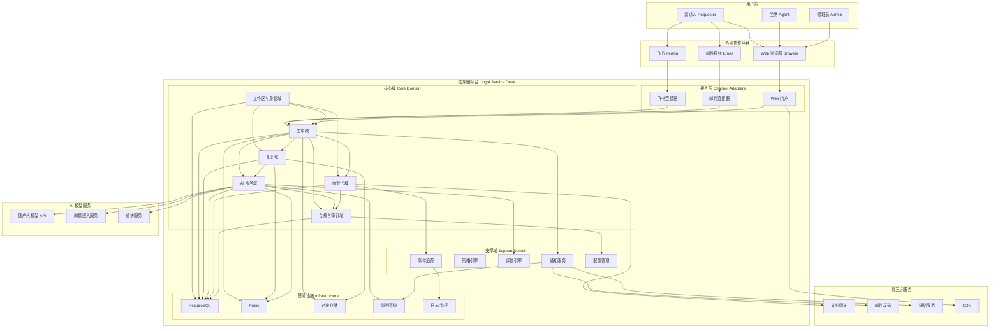

# 系统上下文架构

> **工作产品名：灵犀服务台 / Lingxi Service Desk**  
> **版本：V1.0**  
> **日期：2026-07-14**  
> **架构风格：模块化单体（Modular Monolith）**

---

## 1. 架构原则

| 原则 | 说明 |
|---|---|
| 模块化单体 | 不使用微服务，所有代码在一个仓库，按领域划分模块 |
| 多租户优先 | 从第一天设计多租户隔离，workspace_id 贯穿所有业务表 |
| AI 适配层 | 所有模型调用通过统一网关，不绑定单一供应商 |
| 事务 Outbox | 业务事件可靠投递，保证数据一致性 |
| 连接器解耦 | 外部系统接入通过标准化适配器，核心域不依赖特定平台 |
| 审计无处不在 | 所有写操作必须记录审计日志 |
| 策略引擎 | 自动化和 AI 动作必须经过策略校验 |

---

## 2. 系统上下文图



---

## 3. 核心域说明

### 3.1 工作区与身份域

**职责**：
- 工作区创建和配置
- 用户注册和认证
- 成员邀请和角色管理
- 基础 RBAC 权限控制

**关键实体**：Workspace、User、WorkspaceMember、Role、Permission

### 3.2 工单域

**职责**：
- 请求接收和结构化
- 工单生命周期管理
- 状态机流转
- SLA 计算和监控
- 工单关系管理（合并、关联）

**关键实体**：Request、Ticket、TicketMessage、TicketRelation、SlaPolicy、SlaInstance

### 3.3 知识域

**职责**：
- 文档导入和解析
- 知识切片和向量化
- 知识检索和引用
- 知识生命周期管理
- 知识权限控制

**关键实体**：KnowledgeSource、KnowledgeDocument、KnowledgeChunk、KnowledgeVersion

### 3.4 AI 服务域

**职责**：
- AI Gateway：统一模型调用入口
- 任务路由：根据任务类型选择模型
- RAG 流程：检索、重排、生成、引用验证
- 置信度计算和风险门控
- AI 评估和反馈收集

**关键实体**：AiRun、AiMessage、AiCitation、AiFeedback、PromptVersion、ModelConfig

### 3.5 商业化域

**职责**：
- 套餐和权益管理
- 用量计量和账本
- 订阅和试用管理
- 支付集成
- 配额控制

**关键实体**：Plan、Subscription、Entitlement、UsageLedger、PaymentOrder

### 3.6 合规与审计域

**职责**：
- 多租户隔离执行
- 审计日志记录
- 数据导出和删除
- 敏感信息检测和脱敏
- AI 数据使用控制

**关键实体**：AuditEvent、DataExportJob、DeletionJob、SecurityEvent

---

## 4. 支撑域说明

### 4.1 通知服务

- 站内通知
- 邮件通知
- IM 通知
- 通知模板管理

### 4.2 策略引擎

- 自动化规则评估
- AI 动作审批
- 权限校验
- 风险级别判定

### 4.3 评估引擎

- AI 离线评估（分类准确率、检索 Recall、引用正确率）
- AI 在线评估（采纳率、解决率、负反馈率）
- 回归测试和发布门槛

### 4.4 事件追踪

- 产品分析埋点
- 漏斗分析
- A/B 实验
- 数据隐私保护（自动脱敏）

### 4.5 配置管理

- 工作区级别配置
- 全局配置
- 特性开关
- 环境变量管理

---

## 5. 数据流

### 5.1 请求处理数据流

```
用户请求 → 渠道连接器 → 请求接入服务 → AI 理解服务 → 工单域 → 通知服务 → 用户
                                              ↓
                                     知识域（检索/生成）
                                              ↓
                                     AI 评估引擎（记录反馈）
```

### 5.2 AI 回答数据流

```
用户问题 → AI Gateway → PII 检测 → 任务路由 → 检索/生成 → 引用验证 
→ 置信度门控 → 回答/建议/人工审批 → 反馈收集 → 评估数据
```

### 5.3 知识闭环数据流

```
工单解决 → 触发知识草稿生成 → AI 生成草稿 → 审核发布 → 向量索引 → 
用于后续回答 → 反馈收集 → 知识质量评估
```

---

## 6. 技术栈建议

| 层级 | 建议技术 | 理由 |
|---|---|---|
| Web 前端 | Next.js / React / TypeScript | 全栈能力、SSR、类型安全、生态成熟 |
| API 后端 | NestJS（TypeScript） | 模块化架构、TypeORM、TypeScript、生态完善 |
| 数据库 | PostgreSQL + pgvector | 关系型、向量支持、RLS、成熟稳定 |
| 缓存/会话 | Redis | 高性能、成熟、支持队列 |
| 队列系统 | BullMQ（基于 Redis） | 轻量、与 Redis 集成、延迟任务支持 |
| 对象存储 | 阿里云 OSS / 腾讯云 COS | 国内可用、S3 兼容、安全隔离 |
| 邮件发送 | SendGrid / 阿里云邮件推送 | 稳定、国内可用、退信处理 |
| AI 模型 | 阿里云百炼 / 腾讯混元 / 百度文心 | 国内备案、合规、API 成熟 |
| 部署 | 阿里云 ECS / 容器服务 | 国内低延迟、稳定、运维友好 |
| 监控 | OpenTelemetry + 阿里云日志服务 | 标准化、国内可用、成本可控 |

---

## 7. 关键设计决策

| 决策 | 选择 | 理由 |
|---|---|---|
| 架构风格 | 模块化单体 | 个人工作室运维简单，避免微服务复杂度 |
| 多租户隔离 | workspace_id + RLS | PostgreSQL RLS 成熟，显式过滤安全 |
| 向量检索 | PostgreSQL pgvector | MVP 规模足够，避免引入专用向量数据库 |
| 消息队列 | BullMQ | 基于 Redis，轻量，满足 MVP 需求 |
| AI 模型 | 多家国产模型 API | 合规、成本可控、避免绑定单一供应商 |
| 部署区域 | 中国大陆单区域 | 满足数据本地化要求，低延迟 |
| 认证方式 | 自建邮箱登录 | MVP 阶段简单，后续扩展 OIDC/SAML |