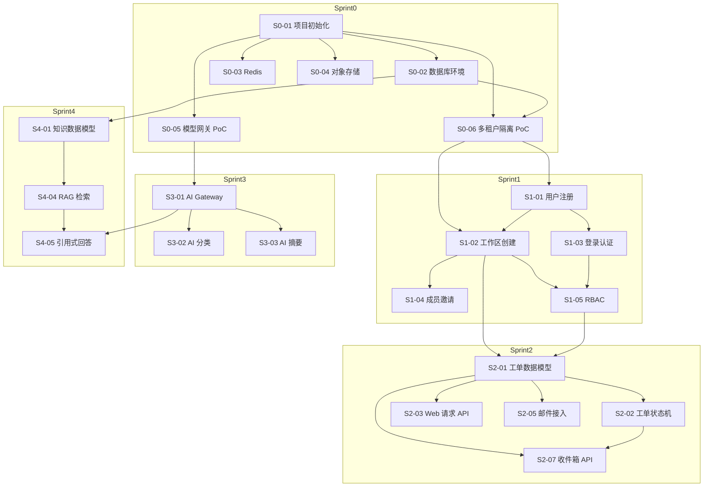

# 开发任务清单

> **工作产品名：灵犀服务台 / Lingxi Service Desk**  
> **版本：V1.0**  
> **日期：2026-07-14**  
> **阶段：MVP（8—12 周）**

---

## 1. 任务划分原则

| 原则 | 说明 |
|---|---|
| 单一目标 | 每个任务只完成一个明确的功能或修复 |
| 独立可测 | 任务完成后可以独立验证 |
| 时间可控 | 单个任务开发时间 ≤ 8 小时（一个编码会话） |
| 依赖清晰 | 明确列出前置依赖 |
| 验收标准 | 每个任务有明确的验收条件 |

---

## 2. Sprint 0：技术选型和环境搭建（第 1—2 周）

| 编号 | 任务 | 描述 | 依赖 | 验收标准 | 估算时间 |
|---|---|---|---|---|---|
| S0-01 | 项目初始化 | 创建 NestJS + Next.js 项目结构，配置 TypeScript | 无 | 项目可正常构建和启动 | 4h |
| S0-02 | 数据库环境搭建 | 配置 PostgreSQL + pgvector，创建初始迁移 | S0-01 | 数据库连接正常，pgvector 可用 | 4h |
| S0-03 | Redis 配置 | 配置 Redis 用于缓存和队列 | S0-01 | Redis 连接正常，基本操作可用 | 2h |
| S0-04 | 对象存储配置 | 配置阿里云 OSS/腾讯云 COS，封装上传下载接口 | S0-01 | 文件上传下载正常 | 4h |
| S0-05 | 模型网关 PoC | 集成阿里云百炼 API，验证分类和生成能力 | S0-01 | 模型调用成功，返回结构化结果 | 6h |
| S0-06 | 多租户隔离 PoC | 实现 workspace_id 字段和 RLS 策略 | S0-02 | 跨租户查询返回空，同租户查询正常 | 4h |
| S0-07 | 统一错误处理 | 定义全局错误结构和异常处理中间件 | S0-01 | API 返回标准化错误响应 | 2h |
| S0-08 | 日志和监控基础 | 配置结构化日志和基础监控指标 | S0-01 | 日志输出正常，指标可采集 | 3h |

---

## 3. Sprint 1：工作区与身份（第 3—4 周）

| 编号 | 任务 | 描述 | 依赖 | 验收标准 | 估算时间 |
|---|---|---|---|---|---|
| S1-01 | 用户注册 API | 实现邮箱注册、密码加密、验证码发送 | S0-01/S0-04 | 用户可通过邮箱注册，验证码验证通过 | 6h |
| S1-02 | 工作区创建 API | 实现工作区创建、配置存储、默认角色分配 | S0-02/S0-06 | 注册后自动创建工作区，数据隔离正常 | 4h |
| S1-03 | 登录认证 API | 实现邮箱密码登录、JWT 生成、会话管理 | S1-01/S1-02 | 用户可登录，JWT 验证通过 | 4h |
| S1-04 | 成员邀请 API | 实现邮件邀请、邀请链接验证、角色分配 | S1-02 | 邀请邮件发送成功，链接可接受并加入工作区 | 6h |
| S1-05 | 基础 RBAC 实现 | 实现角色定义、权限矩阵、API 访问控制 | S1-02/S1-03 | 不同角色访问权限正确，越权返回 403 | 6h |
| S1-06 | 工作区配置 API | 实现工作区名称、时区、语言配置更新 | S1-02 | 配置可更新并持久化 | 2h |
| S1-07 | 用户管理 API | 实现工作区内用户列表、角色变更、移除 | S1-05 | 管理员可管理成员角色和状态 | 4h |
| S1-08 | 前端登录页面 | 实现登录、注册、密码重置页面 | S1-01/S1-03 | 页面可正常访问，表单验证通过 | 6h |

---

## 4. Sprint 2：工单核心与入口（第 5—6 周）

| 编号 | 任务 | 描述 | 依赖 | 验收标准 | 估算时间 |
|---|---|---|---|---|---|
| S2-01 | 工单数据模型 | 实现 Request、Ticket、TicketMessage 实体和关系 | S0-02/S0-06 | 数据库表创建成功，CRUD 操作正常 | 4h |
| S2-02 | 工单状态机 | 实现状态流转逻辑（New→Triage→InProgress→Resolved→Closed） | S2-01 | 状态流转符合业务规则，非法流转被拒绝 | 6h |
| S2-03 | Web 请求门户 API | 实现自然语言请求提交、附件上传、工单创建 | S2-01/S0-04 | 可通过 Web 提交请求并创建工单 | 6h |
| S2-04 | Web 请求门户前端 | 实现请求提交页面，支持文本和附件 | S2-03/S1-08 | 页面美观，提交后显示工单编号 | 6h |
| S2-05 | 邮件接入 API | 实现邮件接收端点、邮件解析、线程关联 | S2-01 | 发送邮件到工作区地址，自动创建工单 | 8h |
| S2-06 | 邮件回复同步 | 实现回复邮件自动追加到工单对话 | S2-05 | 回复邮件后，工单对话中显示新消息 | 4h |
| S2-07 | 统一收件箱 API | 实现队列视图、筛选、分页查询 | S2-01/S1-05 | 可按状态、优先级、来源筛选工单 | 6h |
| S2-08 | 工单详情 API | 实现工单完整信息查询、对话历史、AI 建议展示 | S2-01 | 工单详情包含所有必要信息 | 4h |

---

## 5. Sprint 3：AI 服务域（第 7—8 周）

| 编号 | 任务 | 描述 | 依赖 | 验收标准 | 估算时间 |
|---|---|---|---|---|---|
| S3-01 | AI Gateway 封装 | 实现统一模型调用接口，支持多供应商切换 | S0-05 | 可配置使用不同模型供应商 | 6h |
| S3-02 | AI 分类服务 | 实现意图识别、优先级建议、缺失信息提示 | S3-01/S2-01 | 工单创建后自动完成分类，返回置信度 | 8h |
| S3-03 | AI 摘要服务 | 实现工单摘要生成，区分事实与推断 | S3-01/S2-01 | 生成包含问题、影响、已尝试操作的摘要 | 6h |
| S3-04 | Prompt 版本管理 | 实现 Prompt 存储、版本控制、回滚机制 | S0-02 | Prompt 可版本化管理，支持回滚 | 4h |
| S3-05 | 置信度计算 | 实现综合置信度计算（检索分数、来源一致性、历史准确率） | S3-02/S3-03 | 置信度可配置，阈值生效 | 4h |
| S3-06 | AI 反馈收集 | 实现 AI 建议采纳/拒绝记录，用于评估 | S3-02/S3-03 | 用户反馈可记录并关联到 AI 结果 | 4h |
| S3-07 | AI 评估后台 | 实现离线评估集管理、评估指标计算 | S3-01 | 可运行评估集，查看分类准确率等指标 | 6h |
| S3-08 | AI 异步处理 | 实现 AI 任务队列化，避免阻塞主流程 | S0-03/S2-01 | AI 处理在后台进行，工单可立即创建 | 4h |

---

## 6. Sprint 4：知识库与 RAG（第 9—10 周）

| 编号 | 任务 | 描述 | 依赖 | 验收标准 | 估算时间 |
|---|---|---|---|---|---|
| S4-01 | 知识数据模型 | 实现 KnowledgeDocument、KnowledgeChunk 实体 | S0-02/S0-06 | 数据库表创建成功，支持向量存储 | 4h |
| S4-02 | 文档导入 API | 实现 Markdown、TXT、PDF、DOCX 文档解析和导入 | S4-01/S0-04 | 文档可上传并解析内容 | 6h |
| S4-03 | 知识切片和向量化 | 实现文档自动切片、向量生成、索引更新 | S4-01/S3-01 | 导入文档后自动生成向量索引 | 6h |
| S4-04 | RAG 检索服务 | 实现混合检索（向量 + 关键词）、重排、权限过滤 | S4-03/S1-05 | 检索结果包含相关知识和引用 | 8h |
| S4-05 | 引用式回答生成 | 实现基于检索结果生成回答，包含来源引用 | S4-04/S3-01 | 回答包含知识引用，无幻觉 | 6h |
| S4-06 | 知识状态管理 | 实现 Draft→Review→Published→Archived 状态流转 | S4-01/S1-05 | 知识状态流转符合规则 | 4h |
| S4-07 | 知识权限控制 | 实现全员可见/指定团队可见/坐席专用权限 | S4-01/S1-05 | 权限过滤生效，无权用户看不到敏感知识 | 4h |
| S4-08 | 知识管理前端 | 实现知识列表、上传、编辑、审核页面 | S4-02/S4-06/S4-07 | 页面可管理知识全生命周期 | 6h |

---

## 7. Sprint 5：飞书集成与 SLA（第 11—12 周）

| 编号 | 任务 | 描述 | 依赖 | 验收标准 | 估算时间 |
|---|---|---|---|---|---|
| S5-01 | 飞书 OAuth 集成 | 实现飞书应用授权、Token 管理、权限校验 | S1-02 | 工作区可安装飞书应用并完成授权 | 6h |
| S5-02 | 飞书消息接收 | 实现事件签名校验、消息解析、标准化 | S2-01/S5-01 | 飞书消息可接收并创建工单 | 6h |
| S5-03 | 飞书消息发送 | 实现机器人消息发送、卡片更新 | S2-01/S5-01 | 工单状态变更可同步到飞书卡片 | 4h |
| S5-04 | SLA 数据模型 | 实现 SlaPolicy、SlaInstance 实体 | S2-01 | SLA 策略可创建和存储 | 4h |
| S5-05 | SLA 计算引擎 | 实现响应时间、解决时间、工作日历、暂停恢复 | S5-04 | SLA 计算准确，暂停后恢复正常 | 8h |
| S5-06 | SLA 风险提醒 | 实现 50%/80%/100% 阈值提醒，站内和邮件通知 | S5-05 | 达到阈值时发送提醒通知 | 4h |
| S5-07 | 知识草稿生成 | 实现工单解决后自动生成知识草稿 | S3-01/S4-01 | 工单解决后自动创建知识草稿 | 6h |
| S5-08 | 工单解决确认 | 实现 Resolved 后用户确认流程、满意度评价 | S2-02 | 用户可确认解决或反馈问题，评价记录保存 | 6h |

---

## 8. Sprint 6：商业化与合规（第 13—14 周）

| 编号 | 任务 | 描述 | 依赖 | 验收标准 | 估算时间 |
|---|---|---|---|---|---|
| S6-01 | 套餐与权益数据模型 | 实现 Plan、Subscription、Entitlement 实体 | S0-02/S0-06 | 套餐配置可存储和查询 | 4h |
| S6-02 | 用量计量服务 | 实现工单量、AI 动作消耗的计量和账本 | S2-01/S3-02/S3-03 | 用量准确记录，可查询历史 | 6h |
| S6-03 | 配额控制 | 实现坐席、工单、AI 动作的配额检查和限制 | S6-02/S1-05 | 超出配额时操作被拒绝并提示 | 4h |
| S6-04 | 试用机制 | 实现 Growth 14 天试用、到期回落逻辑 | S6-03 | 试用自动开启，到期自动回落 Free | 4h |
| S6-05 | 支付集成 | 实现第三方聚合支付（微信/支付宝）接入 | S6-01 | 支付流程可完成，订单状态正确 | 8h |
| S6-06 | 审计日志 | 实现所有写操作的审计记录 | S2-01/S3-02/S4-06/S6-01 | 操作记录完整，可查询和导出 | 6h |
| S6-07 | 数据导出 | 实现工单、知识、配置数据的导出功能 | S2-01/S4-01/S0-04 | 数据可导出为 CSV/JSON，权限校验 | 6h |
| S6-08 | 数据删除 | 实现工作区删除、30 天冷静期、数据清理 | S1-02/S0-04 | 删除后数据不可访问，30 天内可恢复 | 6h |

---

## 9. Sprint 7：报表与优化（第 15—16 周）

| 编号 | 任务 | 描述 | 依赖 | 验收标准 | 估算时间 |
|---|---|---|---|---|---|
| S7-01 | 基础报表 API | 实现工单量、解决率、SLA 达成率、AI 采纳率统计 | S2-01/S3-06/S5-05 | 报表数据准确，可按时间筛选 | 6h |
| S7-02 | 报表前端 | 实现看板页面，展示核心指标 | S7-01 | 页面美观，数据可视化清晰 | 6h |
| S7-03 | 产品事件埋点 | 实现核心事件追踪（注册、连接入口、创建工单、解决等） | S1-01/S2-01/S5-08 | 事件正确上报，无敏感信息 | 6h |
| S7-04 | 性能优化 | 优化数据库查询、缓存策略、AI 调用缓存 | S2-01/S3-01/S0-03 | 关键页面响应时间达标 | 8h |
| S7-05 | Onboarding 优化 | 优化注册后的引导流程，降低激活门槛 | S1-01/S2-03/S4-02 | 用户可在 10 分钟内完成首个入口连接 | 6h |
| S7-06 | 安全加固 | 实现密码强哈希、API Token 管理、密钥加密存储 | S1-01/S0-04 | 安全基线达标，无已知高危漏洞 | 6h |
| S7-07 | 自动化测试 | 实现关键流程的端到端测试 | 所有核心模块 | 测试用例覆盖主要场景 | 8h |
| S7-08 | 设计伙伴验证 | 部署测试环境，邀请设计伙伴试用并收集反馈 | S7-01/S7-05 | 3 家设计伙伴连续使用，处理 200+ 真实请求 | 持续 |

---

## 10. 前 20 个开发任务（按优先级排序）

| 序号 | 任务编号 | 任务名称 | 估算时间 |
|---|---|---|---|
| 1 | S0-01 | 项目初始化 | 4h |
| 2 | S0-02 | 数据库环境搭建 | 4h |
| 3 | S0-05 | 模型网关 PoC | 6h |
| 4 | S0-06 | 多租户隔离 PoC | 4h |
| 5 | S1-01 | 用户注册 API | 6h |
| 6 | S1-02 | 工作区创建 API | 4h |
| 7 | S1-03 | 登录认证 API | 4h |
| 8 | S1-05 | 基础 RBAC 实现 | 6h |
| 9 | S2-01 | 工单数据模型 | 4h |
| 10 | S2-02 | 工单状态机 | 6h |
| 11 | S2-03 | Web 请求门户 API | 6h |
| 12 | S2-05 | 邮件接入 API | 8h |
| 13 | S2-07 | 统一收件箱 API | 6h |
| 14 | S3-01 | AI Gateway 封装 | 6h |
| 15 | S3-02 | AI 分类服务 | 8h |
| 16 | S3-03 | AI 摘要服务 | 6h |
| 17 | S4-01 | 知识数据模型 | 4h |
| 18 | S4-02 | 文档导入 API | 6h |
| 19 | S4-04 | RAG 检索服务 | 8h |
| 20 | S4-05 | 引用式回答生成 | 6h |

---

## 11. 首个端到端闭环任务

**推荐首个闭环路径**：

```
注册工作区 → 连接邮件入口 → 发送邮件创建工单 → AI 分类摘要 → 人工处理并解决 → 确认解决
```

**对应的开发任务顺序**：

1. S0-01：项目初始化
2. S0-02：数据库环境搭建
3. S1-01：用户注册 API
4. S1-02：工作区创建 API
5. S1-03：登录认证 API
6. S2-01：工单数据模型
7. S2-02：工单状态机
8. S2-05：邮件接入 API
9. S3-01：AI Gateway 封装
10. S3-02：AI 分类服务
11. S3-03：AI 摘要服务
12. S2-07：统一收件箱 API
13. S5-08：工单解决确认

**闭环验证标准**：
- 用户通过邮箱注册并创建工作区
- 配置工作区专属邮件地址
- 发送测试邮件，自动创建工单
- AI 自动生成分类和摘要
- 坐席在收件箱看到工单并处理
- 标记工单为已解决
- 用户收到解决确认通知

---

## 12. 任务依赖图

